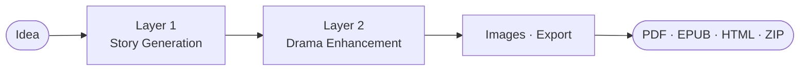

<h1 align="center">StoryForge</h1>

<p align="center">
  <strong>AI-powered story generation with multi-agent drama simulation</strong>
</p>

<p align="center">
  <a href="https://www.python.org/"></a>
  <a href="https://fastapi.tiangolo.com"></a>
  <a href="https://alpinejs.dev"></a>
  <a href="https://www.typescriptlang.org"></a>
  <a href="LICENSE"></a>
  <a href="https://github.com/HieuNTg/STORYFORGE/stargazers"></a>
</p>

<p align="center">
  <a href="README.vi.md">Tiếng Việt</a>
</p>

<p align="center">
  Turn a one-sentence idea into a complete, drama-rich Vietnamese web novel with character-consistent images and cinematic scene backgrounds.<br />
  Self-hosted. Privacy-first. Works with any OpenAI-compatible LLM.
</p>

<p align="center">
  
</p>

---

## Why StoryForge?

Most AI writing tools produce flat, predictable stories. StoryForge takes a different approach: your characters become **autonomous AI agents** that interact, argue, form alliances, and betray each other in a multi-round drama simulation. The simulation uncovers conflicts the author never planned — then rewrites the story around them, scored and revised automatically until it meets a quality threshold.

---

## Screenshots

| Create Story | Settings |
|:---:|:---:|
|  |  |

| Story Library | Light Mode |
|:---:|:---:|
|  |  |

---

## Features

| Area | Highlights |
|------|------------|
| **Story Engine** | 2-layer pipeline (Story Gen + Drama Sim) with checkpoint/resume + SSE; optional L3 sensory polish; 13 specialized agents (drama critic, editor, pacing, dialogue, reader simulator, …); 6-dim LLM-as-judge auto-revision; cumulative story memory; genre-aware naming (VN / Chinese tiên hiệp · wuxia · xianxia / Western); arc scaling; optional ChromaDB RAG. |
| **Story Continuation** | Continue from checkpoint with optional L2 re-enhancement; multi-path preview (2–5); outline editor; collaborative writing (light/medium/heavy polish); consistency checker; arc steering; mid-story chapter insertion + renumber; selective regeneration; retroactive continuity fix. |
| **Layer 1 quality** | Chapter contracts + arc waypoints + arc-memory cache; dialogue injection with voice validation; 4-level tiered context; narrative linking (threads, foreshadowing, conflict escalation); pacing enforcement; self-critique rollback; emotional memory; causal graph. |
| **Layer 2 quality** | Contract gate (single-retry rewrite); parallel chapter enhancement; coherence pre-check; knowledge-graph-bounded prompts; thread urgency; causal accountability w/ audit trail; zero-cost stale-thread / hook / emotion signals. |
| **Branch Reader** | LLM-generated CYOA paths, SSE streaming; SVG tree + minimap (zoom/pan); undo/redo + bookmarks; branch analytics; WebSocket multi-user; EPUB tree export; branch merging w/ conflict detection; 10-depth limit + auto-ending; localStorage persistence. |
| **Images & Export** | Character-consistent IP-Adapter portraits + scene backgrounds; PDF, EPUB, HTML reader, and ZIP export. |
| **LLM & Providers** | OpenAI, Gemini, Anthropic, OpenRouter (290+), Z.AI, Kyma, Ollama, or any OpenAI-compatible endpoint; auto-detect provider; preemptive rate-limit switching with reset-header awareness; chain-level wait-and-retry; latency-aware primary; provider-aware fallback; smart cheap/premium routing (~45% saved); SQLite LLM cache. |
| **UI** | v2.3 SPA on unified `sf-*` design system; Swiss Modernism palette; Vietnamese-first copy; pages: Create / Library / Reader / Analytics / Branching / Settings / Guide; dark + light mode. |
| **Security** | CSRF double-submit; 10 MB body cap; prompt-injection middleware; encrypted secrets at rest (requires `STORYFORGE_SECRET_KEY`); self-hosted; customizable agent prompts in `data/prompts/agent_prompts.yaml`. |

---

## Quick Start

```bash
git clone https://github.com/HieuNTg/STORYFORGE.git
cd STORYFORGE
pip install -r requirements.txt
npm install && npm run build   # compile TypeScript → JS
npm run build:css              # compile Tailwind CSS
python app.py
# → http://localhost:7860
```

### First Run

1. **Settings** → the setup wizard guides you through provider selection, API key, and model — connection tested automatically
2. **Create Story** → pick genre, style, describe your idea in one sentence
3. **Run Pipeline** → watch generation, simulation, and image generation stream in real-time
4. **Continue** → add more chapters to any saved story from checkpoints
5. **Branch Reader** → explore interactive branching paths with SVG tree visualization
6. **Export** → download as PDF, EPUB, HTML, or storyboard ZIP

---

## Deployment & Scaling

### Environment Variables

| Variable | Default | Description |
|----------|---------|-------------|
| `STORYFORGE_SECRET_KEY` | _(file-based)_ | HMAC signing key. Enables encrypted secrets storage. **Set this in production.** |
| `REDIS_URL` | _(none)_ | Redis URL for cache + sessions. Required for multi-instance. |
| `NUM_WORKERS` | `1` | Uvicorn workers. Scale with CPU cores. |
| `STORYFORGE_ALLOWED_ORIGINS` | `localhost:7860` | CORS origins (comma-separated). |
| `TRUSTED_PROXY_IPS` | _(none)_ | Trusted proxy IPs for X-Forwarded-For. |
| `DB_POOL_SIZE` | `5` | SQLAlchemy connection pool size. |
| `STORYFORGE_BLOCK_INJECTION` | `true` | Block detected prompt injections. |
| `CHROMA_PERSIST_DIR` | `data/chroma` | ChromaDB persistence directory for RAG knowledge base. |
| `CHROMA_COLLECTION_NAME` | `storyforge` | ChromaDB collection name. |

### Single Instance (default)
Works out of the box with SQLite cache. No Redis needed.

### Multi-Instance
Requires Redis for shared cache and session state:
```bash
REDIS_URL=redis://localhost:6379 NUM_WORKERS=4 python app.py
```

> ⚠️ Without Redis, each worker has its own in-memory cache — sessions won't be shared.

---

## Configuration

All settings are managed through the **Settings** tab in the web UI and persisted to `data/config.json`. Key environment variables:

| Variable | Description | Default |
|:---------|:------------|:--------|
| `LLM_PROVIDER` | `openai` \| `gemini` \| `anthropic` \| `openrouter` \| `ollama` | `openai` |
| `LLM_API_KEY` | API key for the selected provider | _(none)_ |
| `LLM_MODEL` | Primary model for writing (e.g. `gpt-4o`) | `gpt-4o` |
| `LLM_BASE_URL` | Custom endpoint URL (OpenAI-compatible) | _(provider default)_ |
| `PORT` | Server port | `7860` |

**Per-layer model overrides** and a secondary budget model for analysis tasks can be configured in the UI under Settings → Advanced.

### Compatible Providers

Any provider that exposes an OpenAI-compatible `/v1/chat/completions` endpoint works with StoryForge:

**OpenAI** · **Google Gemini** · **Anthropic** · **OpenRouter** · **Z.AI** · **Kyma API** · **Ollama** · **Any custom endpoint**

### Customizing Agent Prompts

StoryForge ships with 10 customizable agent prompts in `data/prompts/agent_prompts.yaml`. Edit this file to:
- Change the language of AI evaluation (default: Vietnamese)
- Adjust scoring criteria and thresholds
- Modify agent personalities and review focus areas

### Key Pipeline Flags

Defined in `config/defaults.py` (`PipelineConfig`); editable via the Settings UI.

| Flag | Default | Description |
|------|---------|-------------|
| `parallel_chapters_enabled` | `True` | Use `asyncio.gather` batches for chapter writing |
| `chapter_batch_size` | `5` | Chapters per parallel batch; also caps Sprint 3 batched rewriter |
| `adaptive_simulation_rounds` | `True` | 4–10 L2 simulator rounds derived from complexity |
| `enable_structural_rewrite` | `True` | L2 may trigger L1 chapter rewrites |
| `enable_scene_decomposition` | `True` | Scenes injected into chapter prompts |
| `enable_chapter_contracts` | `True` | Per-chapter requirement contracts |
| `enable_quality_gate` | `True` | Inline scoring between layers |
| `l2_consistency_engine` | `True` | Master switch for the A–E consistency improvements |
| `l2_voice_preservation` | `True` | Enforce voice fingerprints during L2 enhancement |
| `l2_drama_ceiling` | `True` | Apply genre-specific drama ceilings |
| `l2_contract_gate` | `True` | Post-L2 contract validation + optional rewrite |
| `voice_revert_use_anchored` | `True` | Sprint 3: speaker-anchored revert; `False` falls back to legacy positional |

### Strict-Mode Env Flags

Both default to warn-and-continue. Set to `1` (or `true`) for fail-fast in CI / dev.

| Variable | Default | Strict effect |
|----------|---------|---------------|
| `STORYFORGE_HANDOFF_STRICT` | warn-and-continue | Raise `HandoffValidationError` on malformed / `extraction_failed` L1->L2 signals |
| `STORYFORGE_SEMANTIC_STRICT` | warn-and-continue | Raise `SemanticVerificationError` on missed foreshadowing payoffs and severity-≥0.8 structural issues |

### Test Markers

Three custom markers are declared in `pyproject.toml`. They are **not** auto-deselected — pass `-m "not <marker>"` when you want to skip them.

| Marker | Use |
|--------|-----|
| `calibration` | Real-model calibration tests; loads `sentence-transformers` (slow) |
| `perf` | 10-chapter pipeline timing benchmarks |
| `bench` | Sprint 3 P8 async-nesting perf bench |

```bash
pytest tests/ -v                                 # full suite (markers included)
pytest tests/ -v -m "not calibration and not bench"   # fast subset
pytest tests/ -v -m calibration                  # only calibration
```

---

## Architecture



- **Layer 1** builds characters, outline, conflict web, foreshadowing, then writes chapters in parallel batches.
- **Layer 2** runs a multi-agent drama simulation, rewrites scenes with voice preservation, and validates chapter contracts.
- **Quality gates, structural rewrites, and smart revision loops** kick in between layers to catch weak chapters automatically.

<details>
<summary>Module breakdown (L1 / L2)</summary>

```
Layer 1 (L1): Story Generation
  outline -> scene decomposition -> chapter writing
  ├── theme_premise_generator
  ├── character_generator + voice_profiler
  ├── outline_builder + outline_critic
  ├── conflict_web_builder + foreshadowing_manager
  ├── scene_decomposer + scene_beat_generator
  ├── chapter_writer (parallel batches)
  └── post_processing

Layer 2 (L2): Drama Enhancement
  analyzer -> simulator -> enhancer
  ├── analyzer (conflict, pacing, character arcs)
  ├── simulator (multi-agent debate, adaptive rounds)
  ├── enhancer (scene-level enhancement)
  └── contract_gate (validation + optional L1 rewrite)
```

Signal flow L1->L2: `conflict_web` and `foreshadowing_plan` feed the simulator;
`arc_waypoints` and `threads` feed the analyzer and enhancer; `voice_fingerprints`
preserve speaker voice through L2 rewrites.

</details>

See [**docs/system-architecture.md**](docs/system-architecture.md) for the full pipeline flow, signal integration, and retry semantics.

---

## Recent Sprints

Three sprints landed on `master` in May 2026, each with an ADR and a plan dir.

### Sprint 1 — L1->L2 Handoff Envelope

Typed `L1Handoff` envelope with `NegotiatedChapterContract` (Pydantic v2, frozen,
`extra="forbid"`) replaces the silent-empty `getattr(draft, "...", None) or []`
pattern across the L1->L2 seam. A reconciliation gate at
`pipeline/handoff_gate.py` validates every signal once before the simulator runs
and persists the envelope on `pipeline_runs.handoff_envelope` (JSON column).
Strict-mode env flag `STORYFORGE_HANDOFF_STRICT=1` makes malformed signals
fail-fast; default is warn-and-continue with structured `signal_health` logged
to the diagnostics endpoint. See [ADR 0001](docs/adr/0001-l1-handoff-envelope.md)
and [plans/260503-2317-l1-l2-handoff-envelope/](plans/260503-2317-l1-l2-handoff-envelope/README.md).

### Sprint 2 — Semantic Verification

Three keyword-driven checks (foreshadowing payoff, structural detector, outline
critic) replaced with local CPU-only embeddings via
`sentence-transformers/paraphrase-multilingual-MiniLM-L12-v2` (384-dim) plus
spaCy `xx_ent_wiki_sm` NER for character presence. The per-chapter LLM payoff
verifier is gone; cosine similarity at threshold `0.55` hit 96.67% accuracy on a
30-pair Vietnamese calibration set (was `0.62` / 73.33%). Embeddings cached in a
new `embedding_cache` SQLite table keyed by `sha256(model_id ␟ NFC(text))`.
LLM-as-judge outline critic replaced with deterministic objective metrics. New
diagnostics endpoint plus UI panel. Strict-mode env flag
`STORYFORGE_SEMANTIC_STRICT=1`. See
[ADR 0002](docs/adr/0002-semantic-verification.md) and
[plans/260504-1213-semantic-verification/](plans/260504-1213-semantic-verification/README.md).

### Sprint 3 — Generation Hardening

Drama ceiling now wires into actual generation: `NegotiatedChapterContract`
gains a derived `drama_ceiling = min(1.0, drama_target + drama_tolerance)` and
the chapter writer injects a Vietnamese `## RÀNG BUỘC KỊCH TÍNH` directive when
the ceiling is set. Voice-preservation revert switched from positional to
speaker-anchored via `(speaker_id, ordinal)` tuples with NFC diacritic
normalisation, fixing dialogue corruption on enhancer reorders. Async D3
contract: simulator, agent registry, and scene enhancer split into canonical
`*_async` plus a sync wrapper that raises `RuntimeError` loudly on a running
loop — `ThreadPoolExecutor` escape hacks deleted. Structural rewriter batched
behind `asyncio.Semaphore(chapter_batch_size)` with `return_exceptions=True`
for per-chapter failure isolation. New flag `voice_revert_use_anchored`
(default `True`). See [ADR 0003](docs/adr/0003-generation-hardening-drama-ceiling.md)
and [plans/260504-1356-generation-hardening/](plans/260504-1356-generation-hardening/README.md).

---

## Tech Stack

| Layer | Technology |
|:------|:-----------|
| Backend | Python 3.10+, FastAPI, Uvicorn |
| Frontend | Alpine.js 3, TypeScript, Tailwind CSS |
| Streaming | Server-Sent Events (SSE) |
| AI / LLM | Any OpenAI-compatible API |
| RAG | ChromaDB, sentence-transformers (optional) |
| Image Generation | IP-Adapter (character consistency), diffusion models (scene backgrounds) |
| Storage | JSON files, SQLite (dev cache), Redis (production cache) |
| Export | fpdf2 (PDF), ebooklib (EPUB) |

---

## Project Structure

```
storyforge/
├── app.py                      # FastAPI entry point
├── mcp_server.py               # MCP tool server
├── pipeline/                   # 2-layer generation engine
│   ├── orchestrator.py         #   Pipeline orchestrator with checkpointing
│   ├── layer1_story/           #   Story generation (characters, world, chapters)
│   ├── layer2_enhance/         #   Drama simulation & enhancement
│   └── agents/                 #   13 specialized AI agents
├── services/                   # Reusable business logic
│   ├── llm/                    #   LLM client with provider abstraction & fallback
│   ├── llm_cache.py            #   Dual-backend cache (Redis / SQLite)
│   ├── rag_knowledge_base.py   #   RAG context retrieval (ChromaDB)
│   ├── pipeline/               #   Quality scoring, branch narrative, smart revision
│   ├── media/                  #   Image generation (character portraits, scenes)
│   ├── export/                 #   PDF, EPUB, HTML, Wattpad exporters
│   ├── infra/                  #   Database, i18n, structured logging
│   └── ...                     #   Analytics, feedback, onboarding, etc.
├── api/                        # FastAPI REST endpoints
│   ├── pipeline_routes.py      #   Pipeline SSE streaming + resume
│   ├── continuation_routes.py  #   Continue story with new chapters
│   ├── branch_routes.py        #   Interactive branch reader API
│   ├── config_routes.py        #   Settings CRUD + connection test
│   ├── export_routes.py        #   PDF, EPUB, ZIP export
│   └── ...                     #   Analytics, health, metrics, etc.
├── web/                        # Alpine.js frontend (SPA)
│   ├── index.html              #   Main application
│   ├── js/                     #   TypeScript source → compiled to JS via tsc
│   └── css/                    #   Tailwind CSS + custom styles
├── config/                     # Configuration package
├── data/prompts/               # Customizable agent prompts (YAML)
├── models/                     # Pydantic data models
├── plugins/                    # Plugin system
├── tests/                      # Test suite (unit, integration, security, load)
└── scripts/                    # Utility scripts
```

---

## Documentation

- **[docs/](docs/README.md)** — full docs index (architecture, code standards, deployment)
- **[docs/adr/](docs/adr/)** — architecture decision records:
  - [0001 — L1 handoff envelope](docs/adr/0001-l1-handoff-envelope.md)
  - [0002 — Semantic verification](docs/adr/0002-semantic-verification.md)
  - [0003 — Drama ceiling on `NegotiatedChapterContract`](docs/adr/0003-generation-hardening-drama-ceiling.md)
- **[plans/](plans/README.md)** — sprint plan dirs (READMEs, phases, schemas, risks)

---

## Contributing

Contributions are welcome! Please read [CONTRIBUTING.md](CONTRIBUTING.md) to get started — it covers development setup, code style, the PR process, and how to find good first issues.

---

## License

[MIT](LICENSE) — Copyright 2026 StoryForge Contributors

---

## Acknowledgments

StoryForge is built on the shoulders of excellent open source work:

- [FastAPI](https://fastapi.tiangolo.com) — modern Python web framework
- [Alpine.js](https://alpinejs.dev) — lightweight reactive frontend
- [Tailwind CSS](https://tailwindcss.com) — utility-first CSS
- [fpdf2](https://py-pdf.github.io/fpdf2/) — PDF generation
- [ebooklib](https://github.com/aerkalov/ebooklib) — EPUB generation
- All LLM providers — OpenAI, Google, Anthropic, OpenRouter, and the Ollama community
