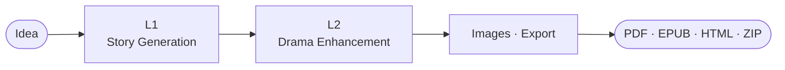

<h1 align="center">StoryForge</h1>

<p align="center"><strong>AI story generation with multi-agent drama simulation</strong></p>

<p align="center">
  <a href="https://www.python.org/"></a>
  <a href="https://fastapi.tiangolo.com"></a>
  <a href="LICENSE"></a>
  <a href="README.vi.md">Tiếng Việt</a>
</p>

<p align="center">
  Turn a one-sentence idea into a complete, drama-rich Vietnamese web novel — with character-consistent images, cinematic backgrounds, and any OpenAI-compatible LLM. Self-hosted.
</p>

<p align="center">
  
</p>

---

## Why

Most AI writers produce flat stories. StoryForge turns each character into an **autonomous agent** that argues, allies, and betrays in a multi-round drama simulation — uncovering conflicts the author never planned, then rewriting around them until quality thresholds clear.

---

## Quick Start

```bash
git clone https://github.com/HieuNTg/STORYFORGE.git
cd STORYFORGE
pip install -r requirements.txt
python app.py                       # API → http://localhost:7860

# In a second terminal, the Next.js UI:
cd frontend && npm install && npm run dev -- --port 3001   # UI → http://localhost:3001
```

Then **Settings → API Keys** (add provider profiles + choose models) → **Forge** → **Run** → **Library / Reader / Branching / Simulation** → **Export** (PDF/EPUB/HTML/ZIP).

---

## Features

- **2-layer pipeline** — L1 story generation → L2 drama simulation, with checkpoints, SSE streaming, optional L3 sensory polish
- **13 specialized agents** — drama critic, editor, pacing, dialogue, reader simulator, …; 6-dim LLM-as-judge auto-revision
- **Vietnamese-first** — VN names default; Chinese tiên hiệp / wuxia / xianxia and Western/Sci-Fi optional; arc scaling by chapter count
- **Continuation tools** — multi-path preview, outline editor, collaborative polish, consistency checker, mid-story insertion, retroactive fixes
- **Local-library-first flows** — Reader, Branching, Simulation, and Characters start from stories already saved in the local library; no fake `demo` sessions or pasted orphan text.
- **Branch reader** — LLM-generated CYOA, SVG tree + minimap, undo/redo, bookmarks, WebSocket multi-user, EPUB tree export
- **Images & Video** — IP-Adapter character portraits + scene backgrounds; optional [FlowKit provider](docs/flowkit-integration.md) proxies a local Google Labs session for free Imagen 3 + Veo via a Chrome MV3 extension (local-only, account-ban risk — use a secondary Google account)
- **Provider profiles + model dropdowns** — Settings has quick-add cards for Gemini, Anthropic, OpenAI, OpenRouter Free, Z.AI, and Kyma. Model choice is a select list (including Gemini/Gemma, OpenRouter free text models, OpenAI/Anthropic, GLM/Qwen/DeepSeek fallbacks), and L1/L2/cheap-model routing chooses from configured provider profiles instead of raw text fields.
- **Any OpenAI-compatible LLM** — OpenAI, Gemini, Anthropic, OpenRouter, Z.AI, Kyma, Ollama, custom; preemptive rate-limit switching, latency-aware routing, smart cheap/premium routing, SQLite cache
- **Security** — CSRF double-submit, 10 MB body cap, prompt-injection middleware, encrypted secrets at rest

---

## Configuration

Settings tab persists to `data/config.json`. When `STORYFORGE_SECRET_KEY` is set,
sensitive fields in that file are encrypted. Key env vars:

| Variable | Purpose |
|----------|---------|
| `STORYFORGE_API_KEY` / `STORYFORGE_BASE_URL` / `STORYFORGE_MODEL` | provider key, OpenAI-compatible base URL, primary model |
| `STORYFORGE_SECRET_KEY` | encryption/signing key — **set in production** for encrypted secrets |
| `STORYFORGE_AUTH_REQUIRED` | `1` = enforce JWT/RBAC on sensitive API routes |
| `REDIS_URL` | required for multi-instance (`NUM_WORKERS>1`) shared cache/sessions |
| `STORYFORGE_ALLOWED_ORIGINS` | CORS origins (comma-separated) |
| `STORYFORGE_HANDOFF_STRICT` | `1` = fail-fast on malformed L1→L2 signals (default: warn) |
| `STORYFORGE_SEMANTIC_STRICT` | `1` = fail-fast on missed foreshadowing payoffs (default: warn) |
| `CHROMA_PERSIST_DIR` / `CHROMA_COLLECTION_NAME` | RAG persistence |

Per-layer model overrides, drama ceilings, batch size, voice-revert anchoring, etc. live in `config/defaults.py` (`PipelineConfig`) and the Settings UI. Agent prompts are editable in `data/prompts/agent_prompts.yaml`.

### Current UI routes

| Route | Purpose | Notes |
|-------|---------|-------|
| `/library/` | Local story library | Source of truth for reader, branching, simulation, and character tools |
| `/forge/` | One-sentence story creation pipeline | Runs the main generation flow |
| `/reader/` | Story/chapter picker | Opens `/reader/[storyId]/[chapterId]` after a local story is selected |
| `/branching/` | Branch-session starter | Selects a local story, then creates a real `/branching/[sessionId]/` session |
| `/simulation/` | Multi-character stage setup | Selects a local story and characters; transcript simulation can be enabled via config |
| `/characters/` | Character list/detail/generation | Story picker is controlled and library-backed |
| `/settings/` | General, API Keys, L1/L2 settings | Provider quick-add, model dropdowns, image style select |
| `/providers/` | Provider status table | Shows configured provider profiles only; legacy Primary/Mặc định row is hidden |


### Test markers

```bash
pytest tests/ -v -m "not calibration and not bench"   # fast subset
pytest tests/ -v -m calibration                       # real-model calibration
```

---

## Architecture



L1→L2 signals: `conflict_web` + `foreshadowing_plan` feed the simulator; `arc_waypoints` + `threads` feed the analyzer/enhancer; `voice_fingerprints` preserve speaker voice through L2 rewrites.

See [`docs/system-architecture.md`](docs/system-architecture.md) for the full flow.

---

## Documentation

- [`docs/`](docs/README.md) — full index (architecture, code standards, deployment)
- [`docs/adr/`](docs/adr/) — architecture decision records
- [CONTRIBUTING.md](CONTRIBUTING.md) — dev setup, code style, PR process

---

## License

[MIT](LICENSE) — Copyright 2026 StoryForge Contributors
