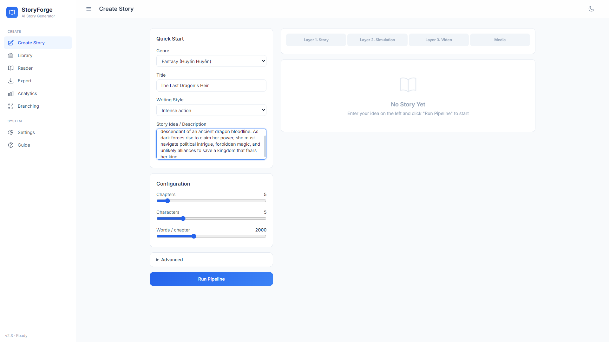
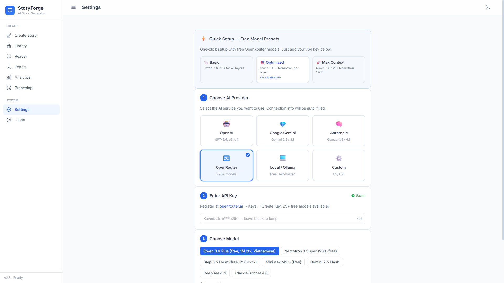
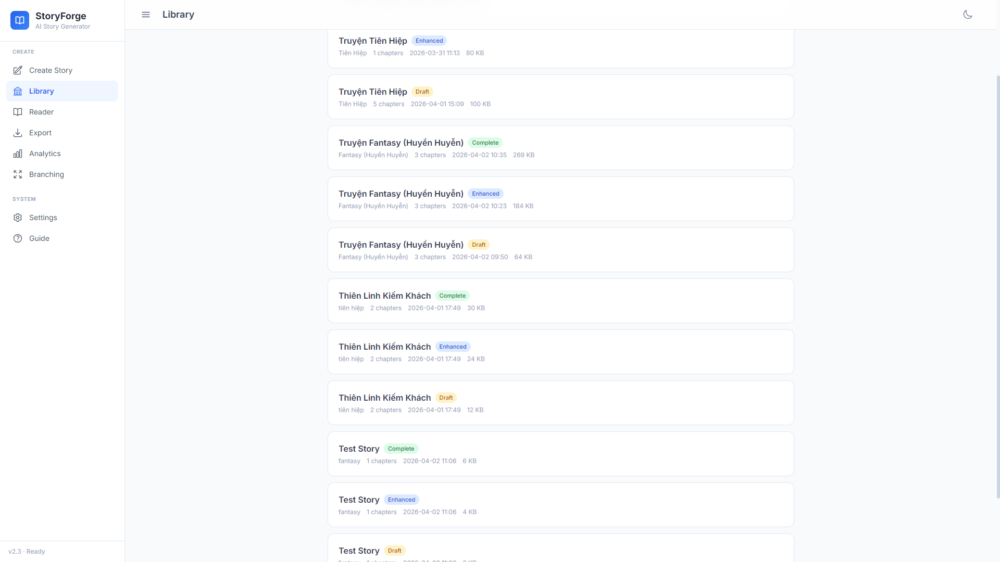
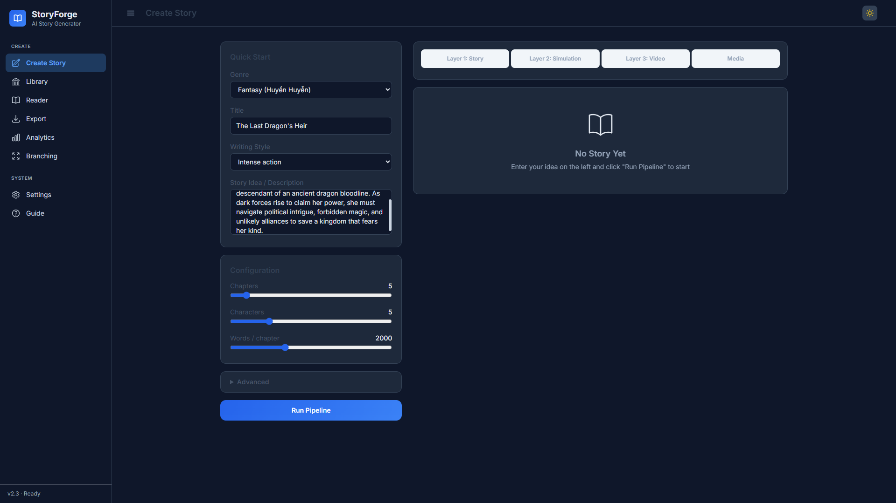
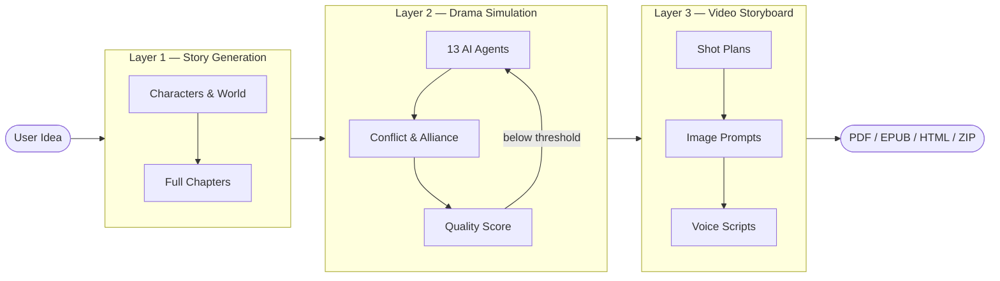

<h1 align="center">StoryForge</h1>

<p align="center">
  <strong>AI-powered story generation with multi-agent drama simulation</strong>
</p>

<p align="center">
  <a href="https://github.com/HieuNTg/STORYFORGE/actions/workflows/ci.yml"></a>
  <a href="https://www.python.org/"></a>
  <a href="https://fastapi.tiangolo.com"></a>
  <a href="https://alpinejs.dev"></a>
  <a href="https://www.typescriptlang.org"></a>
  <a href="https://hub.docker.com"></a>
  <a href="LICENSE"></a>
  <a href="https://github.com/HieuNTg/STORYFORGE/stargazers"></a>
</p>

<p align="center">
  <a href="README.vi.md">Tiếng Việt</a> · <a href="https://railway.app/new/template?template=https://github.com/HieuNTg/STORYFORGE">Deploy on Railway</a> · <a href="https://render.com/deploy?repo=https://github.com/HieuNTg/STORYFORGE">Deploy on Render</a>
</p>

<p align="center">
  Turn a one-sentence idea into a complete, drama-rich story with video-ready storyboards.<br />
  Self-hosted. Privacy-first. Works with any OpenAI-compatible LLM.
</p>

<p align="center">
  
</p>

---

## Why StoryForge?

Most AI writing tools produce flat, predictable stories. StoryForge takes a different approach: your characters become **autonomous AI agents** that interact, argue, form alliances, and betray each other in a multi-round drama simulation. The simulation uncovers conflicts the author never planned — then rewrites the story around them, scored and revised automatically until it meets a quality threshold.

---

## Screenshots

| Create Story | Settings |
|:---:|:---:|
|  |  |

| Story Library | Light Mode |
|:---:|:---:|
|  |  |

---

## Features

- **3-layer pipeline** — Story Generation → Drama Simulation → Video Storyboarding, with checkpoint & resume and real-time SSE streaming
- **13 specialized AI agents** — autonomous character agents plus a drama critic, editor-in-chief, pacing analyzer, style consistency checker, dialogue expert, and more
- **Quality scoring & auto-revision** — 4-dimension LLM-as-judge (coherence, character, drama, writing style) with an automated re-enhancement loop
- **Multi-provider LLM support** — OpenAI, Google Gemini, Anthropic, OpenRouter (290+ models), Ollama (local), or any custom OpenAI-compatible endpoint
- **Vietnamese & English** — bilingual story generation out of the box
- **Rich export** — PDF, EPUB, HTML web reader, and full video storyboards with shot-by-shot camera direction and image prompts
- **Interactive branch reader** — choose-your-own-adventure mode with LLM-generated branching paths
- **Dark / Light mode** — polished theme toggle with full color-scheme sync across all pages
- **Self-hosted, privacy-first** — your stories and API keys never leave your infrastructure
- **Smart model routing** — assign cheap models to analysis tasks and premium models to writing (~45% cost savings)
- **Customizable agent prompts** — edit `data/prompts/agent_prompts.yaml` to tune how AI agents evaluate and enhance stories
- **Text-to-speech narration** — in-browser audio via `edge-tts`, no extra API key required

---

## Quick Start

### Docker (recommended)

```bash
docker compose up
```

Open [http://localhost:7860](http://localhost:7860). That's it.

### One-Click Deploy

[](https://railway.app/new/template?template=https://github.com/HieuNTg/STORYFORGE)

### Local

```bash
git clone https://github.com/HieuNTg/STORYFORGE.git
cd STORYFORGE
pip install -r requirements.txt
npm install && npm run build   # compile TypeScript → JS
npm run build:css              # compile Tailwind CSS
python app.py
# → http://localhost:7860
```

### First Run

1. **Settings** → choose your AI provider, enter API key, select model
2. **Create Story** → pick genre, style, describe your idea in one sentence
3. **Run Pipeline** → watch generation, simulation, and storyboarding stream in real-time
4. **Reader** → read the finished story or launch Branch Mode for interactive paths
5. **Export** → download as PDF, EPUB, HTML, or storyboard ZIP

---

## Configuration

All settings are managed through the **Settings** tab in the web UI and persisted to `data/config.json`. Key environment variables for Docker deployments:

| Variable | Description | Default |
|:---------|:------------|:--------|
| `LLM_PROVIDER` | `openai` \| `gemini` \| `anthropic` \| `openrouter` \| `ollama` | `openai` |
| `LLM_API_KEY` | API key for the selected provider | _(none)_ |
| `LLM_MODEL` | Primary model for writing (e.g. `gpt-4o`) | `gpt-4o` |
| `LLM_BASE_URL` | Custom endpoint URL (OpenAI-compatible) | _(provider default)_ |
| `SECRET_KEY` | Session secret for JWT auth | _(auto-generated)_ |
| `PORT` | Server port | `7860` |

**Per-layer model overrides** and a secondary budget model for analysis tasks can be configured in the UI under Settings → Advanced.

### Compatible Providers

Any provider that exposes an OpenAI-compatible `/v1/chat/completions` endpoint works with StoryForge:

**OpenAI** · **Google Gemini** · **Anthropic** · **OpenRouter** · **Ollama** · **Any custom endpoint**

### Customizing Agent Prompts

StoryForge ships with 10 customizable agent prompts in `data/prompts/agent_prompts.yaml`. Edit this file to:
- Change the language of AI evaluation (default: Vietnamese)
- Adjust scoring criteria and thresholds
- Modify agent personalities and review focus areas

---

## Architecture

```
                        ┌─────────────────────────────────────────┐
  User Prompt  ────────▶│         Layer 1 — Story Generation      │
                        │  Characters · World · Chapters · Context │
                        └──────────────────┬──────────────────────┘
                                           │
                        ┌──────────────────▼──────────────────────┐
                        │       Layer 2 — Drama Simulation         │
                        │  13 AI Agents · Conflict Emergence       │
                        │  Drama Scoring · Auto-Revision Loop      │
                        └──────────────────┬──────────────────────┘
                                           │
                        ┌──────────────────▼──────────────────────┐
                        │       Layer 3 — Video Storyboard         │
                        │  Shot Plans · Camera · Image Prompts     │
                        │  Voice Scripts · Sound Design            │
                        └──────────────────┬──────────────────────┘
                                           │
                              PDF · EPUB · HTML · ZIP
```



---

## Tech Stack

| Layer | Technology |
|:------|:-----------|
| Backend | Python 3.10+, FastAPI, Uvicorn |
| Frontend | Alpine.js 3, TypeScript, Tailwind CSS |
| Streaming | Server-Sent Events (SSE) |
| AI / LLM | Any OpenAI-compatible API |
| Text-to-Speech | edge-tts (no API key required) |
| Storage | JSON files, SQLite (cache) |
| Export | ReportLab (PDF), ebooklib (EPUB) |
| Auth & Security | JWT, rate limiting, audit logging |
| Monitoring | Prometheus, Grafana, Loki |
| Containerization | Docker, Docker Compose |
| CI/CD | GitHub Actions |

---

## Project Structure

```
storyforge/
├── app.py                      # FastAPI entry point
├── config.py                   # Configuration singleton
├── pipeline/                   # 3-layer generation engine
│   ├── orchestrator.py         #   Pipeline orchestrator with checkpointing
│   ├── layer1_story/           #   Story generation (characters, world, chapters)
│   ├── layer2_enhance/         #   Drama simulation & enhancement
│   ├── layer3_video/           #   Storyboard & voice scripts
│   └── agents/                 #   13 specialized AI agents
├── services/                   # Reusable business logic
│   ├── llm/                    #   LLM client with fallback chain
│   ├── quality_scorer.py       #   4-dimension scoring
│   ├── branch_narrative.py     #   Interactive branch reader
│   ├── tts_audio_generator.py  #   Text-to-speech
│   └── ...                     #   Export, auth, analytics, etc.
├── api/                        # FastAPI REST endpoints
│   ├── pipeline_routes.py      #   Pipeline SSE streaming + resume
│   ├── config_routes.py        #   Settings CRUD + connection test
│   ├── export_routes.py        #   PDF, EPUB, ZIP export
│   └── ...
├── web/                        # Alpine.js frontend (SPA)
│   ├── index.html
│   └── js/                     #   TypeScript source → compiled to JS via tsc
├── data/prompts/               # Customizable agent prompts (YAML)
├── middleware/                  # Auth, rate limiting, audit logging
├── monitoring/                 # Prometheus, Grafana, Loki configs
├── models/schemas.py           # Pydantic data models
└── tests/                      # Test suite (73 files, 18K+ LOC)
```

---

## Contributing

Contributions are welcome! Please read [CONTRIBUTING.md](CONTRIBUTING.md) to get started — it covers development setup, code style, the PR process, and how to find good first issues.

---

## License

[MIT](LICENSE) — Copyright 2026 StoryForge Contributors

---

## Acknowledgments

StoryForge is built on the shoulders of excellent open source work:

- [FastAPI](https://fastapi.tiangolo.com) — modern Python web framework
- [Alpine.js](https://alpinejs.dev) — lightweight reactive frontend
- [Tailwind CSS](https://tailwindcss.com) — utility-first CSS
- [ReportLab](https://www.reportlab.com) — PDF generation
- [ebooklib](https://github.com/aerkalov/ebooklib) — EPUB generation
- [edge-tts](https://github.com/rany2/edge-tts) — free text-to-speech
- All LLM providers — OpenAI, Google, Anthropic, OpenRouter, and the Ollama community
