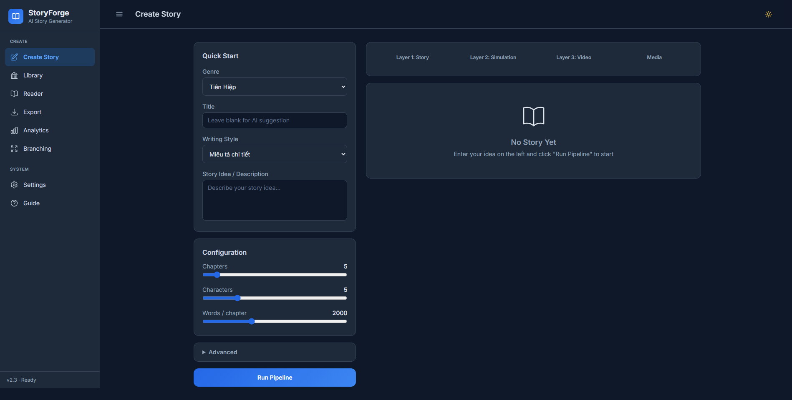
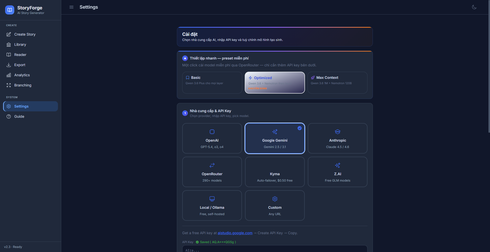
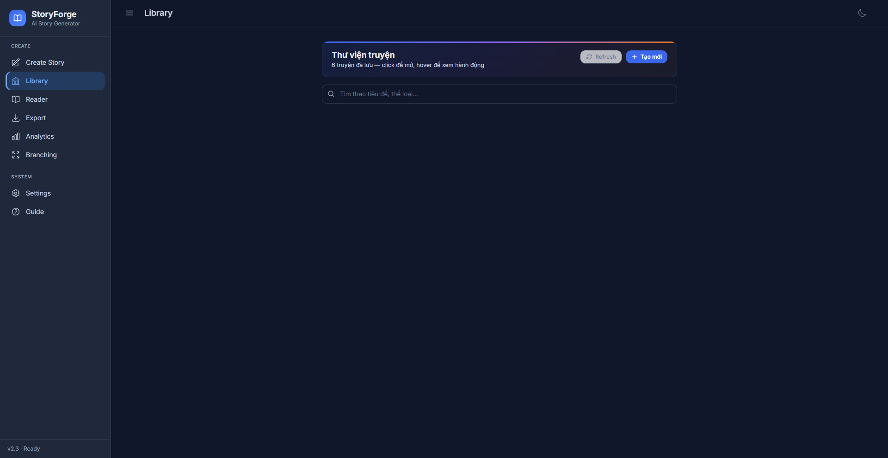
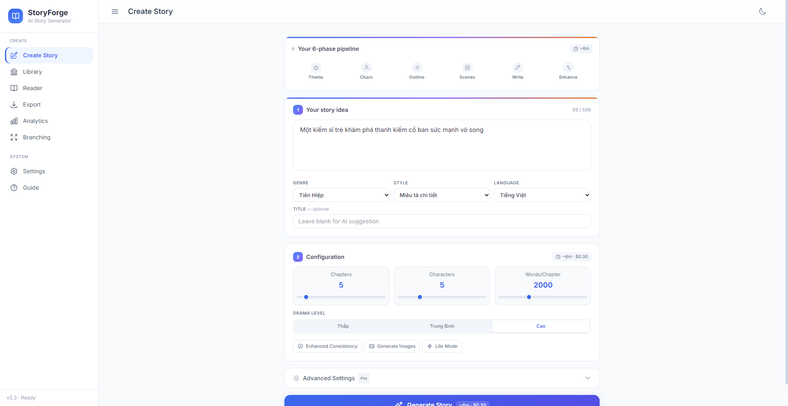
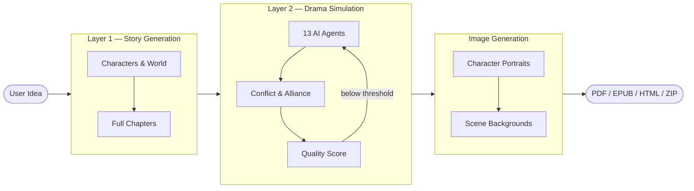

<h1 align="center">StoryForge</h1>

<p align="center">
  <strong>AI-powered story generation with multi-agent drama simulation</strong>
</p>

<p align="center">
  <a href="https://www.python.org/"></a>
  <a href="https://fastapi.tiangolo.com"></a>
  <a href="https://alpinejs.dev"></a>
  <a href="https://www.typescriptlang.org"></a>
  <a href="LICENSE"></a>
  <a href="https://github.com/HieuNTg/STORYFORGE/stargazers"></a>
</p>

<p align="center">
  <a href="README.vi.md">Tiếng Việt</a>
</p>

<p align="center">
  Turn a one-sentence idea into a complete, drama-rich story with character-consistent images and cinematic scene backgrounds.<br />
  Self-hosted. Privacy-first. Works with any OpenAI-compatible LLM.
</p>

<p align="center">
  
</p>

---

## Why StoryForge?

Most AI writing tools produce flat, predictable stories. StoryForge takes a different approach: your characters become **autonomous AI agents** that interact, argue, form alliances, and betray each other in a multi-round drama simulation. The simulation uncovers conflicts the author never planned — then rewrites the story around them, scored and revised automatically until it meets a quality threshold.

---

## Screenshots

| Create Story | Settings |
|:---:|:---:|
|  |  |

| Story Library | Light Mode |
|:---:|:---:|
|  |  |

---

## Features

### Story Engine
- **2-layer pipeline** — Story Generation → Drama Simulation, with checkpoint & resume and real-time SSE streaming
- **L3 Sensory Polish** — optional post-enhancement layer for vivid sensory details and immersive prose
- **14 specialized AI agents** — autonomous character agents plus a drama critic, editor-in-chief, pacing analyzer, style consistency checker, dialogue expert, reader simulator, and more
- **Reader Simulator agent** — simulates reader reactions to provide quality feedback before finalization
- **Quality scoring & auto-revision** — 6-dimension LLM-as-judge (coherence, character, drama, writing style, thematic depth, dialogue quality) with an automated re-enhancement loop
- **Cumulative story memory** — character knowledge, relationships, and plot threads accumulate across chapters instead of resetting, ensuring multi-chapter continuity
- **RAG knowledge base** — optional world-building context retrieval via ChromaDB + sentence-transformers; upload `.txt`, `.md`, or `.pdf` reference files to enrich story generation

### Advanced Story Continuation
- **Continue story** — append new chapters to existing stories from saved checkpoints, with configurable chapter count and word count; optional Layer 2 re-enhancement on the full story
- **Multi-path preview** — preview 2-5 different continuation directions with summaries and outlines; click to select and write
- **Outline editor** — generate chapter outlines first, edit titles and summaries inline, then write from approved outlines
- **Collaborative chapter writing** — write your own chapter text, then let AI polish it with 3 levels (light/medium/heavy)
- **Consistency checker** — scan story for contradictions in characters, timeline, facts, and locations; view issues with severity and suggested fixes
- **Character arc steering** — guide character development trajectory across new chapters
- **Chapter insertion** — insert new chapters mid-story with automatic renumbering
- **Selective chapter regeneration** — regenerate specific chapters without affecting others
- **Retroactive consistency fix** — automatically fix continuity errors in earlier chapters when new chapters introduce changes

### Layer 1 — Story Generation Quality
- **Chapter contracts** — per-chapter requirements with validation and failure propagation
- **Arc waypoints** — character arc milestones with validation
- **Arc memory cache** — persistent cache for arc state across generation runs
- **Dialogue injection** — natural dialogue insertion and voice consistency validation
- **Tiered context system** — 4-level priority context management for long stories (full/summary/key-points/minimal)
- **Narrative linking** — thread dependencies, semantic foreshadowing, conflict escalation tracking
- **Pacing enforcement** — automatic pacing analysis with corrective rewriting
- **Self-critique with rollback** — LLM self-evaluation with automatic rollback on quality failure
- **Feedback loops** — pacing correction, location validation, selective critique
- **Emotional memory** — character emotional state tracking across chapters
- **Causal graph** — cause-effect relationship tracking for plot consistency

### Layer 2 — Drama Simulation Quality
- **Contract gate** — per-chapter validation with single-retry rewrite on failure
- **Parallel processing** — concurrent chapter enhancement for faster throughput
- **Coherence pre-check** — validates consistency before enhancement begins
- **Knowledge constraints** — agent prompts bounded by character knowledge graphs
- **Thread urgency** — psychological pressure tracking wired into agent behavior
- **Causal accountability** — revelation events, witness propagation, LLM audit trail
- **Knowledge context** — agent prompts enriched with causal chain formatting
- **Zero-cost quality signals** — stale thread detection, chapter hooks, emotional arc tracking

### Interactive Branch Reader
- **Choose-your-own-adventure** — LLM-generated branching paths with real-time SSE streaming and live text animation
- **SVG tree visualization** — interactive tree map of all branches with clickable goto-node navigation
- **Undo/Redo navigation** — navigate back and forth through your choice history with full state preservation
- **Bookmarks** — save and jump to any node in the tree; bookmarks persist across sessions
- **Branch analytics** — track visits, unique paths explored, popular choices, and depth distribution
- **Minimap with zoom/pan** — bird's-eye view of the entire tree with zoom controls and current position indicator
- **WebSocket collaboration** — real-time multi-user sessions with live user count and synchronized navigation
- **EPUB export** — download the entire branch tree as an EPUB with all paths included
- **Branch merging** — merge divergent branches back together with conflict detection and resolution
- **10-level depth limit** — automatic ending generation when maximum depth is reached
- **Session persistence** — branch reader state saved to localStorage, survives page refresh
- **Chapter selection** — load any story from the current pipeline or saved checkpoints into branch mode

### Image & Export
- **Image generation** — character-consistent portraits (IP-Adapter) and cinematic scene backgrounds, generated after drama simulation
- **Rich export** — PDF, EPUB, HTML web reader, and ZIP with chapters and image prompts

### LLM & Providers
- **Multi-provider LLM support** — OpenAI, Google Gemini, Anthropic, OpenRouter (290+ models), Z.AI (free models), Kyma API, Ollama (local), or any custom OpenAI-compatible endpoint; auto-detect provider from API key
- **Multi-provider fallback** — configure fallback profiles that auto-switch between providers on rate limit or failure; honors rate-limit reset headers
- **Provider-aware model routing** — automatic model format adaptation per provider in fallback chains
- **Auto-router support** — let the system pick the best model for each task based on cost/capability tradeoffs
- **Smart model routing** — assign cheap models to analysis tasks and premium models to writing (~45% cost savings)
- **Built-in LLM cache** — SQLite-backed cache to avoid redundant API calls

### UI & Experience
- **Redesigned pipeline page** — modernized Create Story form with hero cards, config pills, and persistent form state
- **Image generation toggle** — enable/disable image generation from the Create Story page
- **Settings wizard** — guided multi-step provider setup with provider-specific model lists, API key masking, and connection testing
- **Consistency toggle** — enable/disable Layer 1 consistency modules from the UI
- **Heroicons SVG icons** — all emoji icons replaced with crisp Heroicons SVGs
- **Dark / Light mode** — polished theme toggle with full color-scheme sync across all pages
- **Vietnamese & English** — bilingual story generation out of the box

### Security & Infrastructure
- **CSRF protection** — double-submit cookie pattern on all state-changing requests
- **Body size limit** — 10 MB request payload limit
- **Prompt injection blocking** — middleware detects and blocks injection patterns in JSON payloads
- **Encrypted secrets** — API keys encrypted at rest in `data/secrets.json` (requires `STORYFORGE_SECRET_KEY`)
- **Self-hosted, privacy-first** — your stories and API keys never leave your infrastructure
- **Customizable agent prompts** — edit `data/prompts/agent_prompts.yaml` to tune how AI agents evaluate and enhance stories

---

## Quick Start

```bash
git clone https://github.com/HieuNTg/STORYFORGE.git
cd STORYFORGE
pip install -r requirements.txt
npm install && npm run build   # compile TypeScript → JS
npm run build:css              # compile Tailwind CSS
python app.py
# → http://localhost:7860
```

### First Run

1. **Settings** → the setup wizard guides you through provider selection, API key, and model — connection tested automatically
2. **Create Story** → pick genre, style, describe your idea in one sentence
3. **Run Pipeline** → watch generation, simulation, and image generation stream in real-time
4. **Continue** → add more chapters to any saved story from checkpoints
5. **Branch Reader** → explore interactive branching paths with SVG tree visualization
6. **Export** → download as PDF, EPUB, HTML, or storyboard ZIP

---

## Deployment & Scaling

### Environment Variables

| Variable | Default | Description |
|----------|---------|-------------|
| `STORYFORGE_SECRET_KEY` | _(file-based)_ | HMAC signing key. Enables encrypted secrets storage. **Set this in production.** |
| `REDIS_URL` | _(none)_ | Redis URL for cache + sessions. Required for multi-instance. |
| `NUM_WORKERS` | `1` | Uvicorn workers. Scale with CPU cores. |
| `STORYFORGE_ALLOWED_ORIGINS` | `localhost:7860` | CORS origins (comma-separated). |
| `TRUSTED_PROXY_IPS` | _(none)_ | Trusted proxy IPs for X-Forwarded-For. |
| `DB_POOL_SIZE` | `5` | SQLAlchemy connection pool size. |
| `STORYFORGE_BLOCK_INJECTION` | `true` | Block detected prompt injections. |
| `CHROMA_PERSIST_DIR` | `data/chroma` | ChromaDB persistence directory for RAG knowledge base. |
| `CHROMA_COLLECTION_NAME` | `storyforge` | ChromaDB collection name. |

### Single Instance (default)
Works out of the box with SQLite cache. No Redis needed.

### Multi-Instance
Requires Redis for shared cache and session state:
```bash
REDIS_URL=redis://localhost:6379 NUM_WORKERS=4 python app.py
```

> ⚠️ Without Redis, each worker has its own in-memory cache — sessions won't be shared.

---

## Configuration

All settings are managed through the **Settings** tab in the web UI and persisted to `data/config.json`. Key environment variables:

| Variable | Description | Default |
|:---------|:------------|:--------|
| `LLM_PROVIDER` | `openai` \| `gemini` \| `anthropic` \| `openrouter` \| `ollama` | `openai` |
| `LLM_API_KEY` | API key for the selected provider | _(none)_ |
| `LLM_MODEL` | Primary model for writing (e.g. `gpt-4o`) | `gpt-4o` |
| `LLM_BASE_URL` | Custom endpoint URL (OpenAI-compatible) | _(provider default)_ |
| `PORT` | Server port | `7860` |

**Per-layer model overrides** and a secondary budget model for analysis tasks can be configured in the UI under Settings → Advanced.

### Compatible Providers

Any provider that exposes an OpenAI-compatible `/v1/chat/completions` endpoint works with StoryForge:

**OpenAI** · **Google Gemini** · **Anthropic** · **OpenRouter** · **Z.AI** · **Kyma API** · **Ollama** · **Any custom endpoint**

### Customizing Agent Prompts

StoryForge ships with 10 customizable agent prompts in `data/prompts/agent_prompts.yaml`. Edit this file to:
- Change the language of AI evaluation (default: Vietnamese)
- Adjust scoring criteria and thresholds
- Modify agent personalities and review focus areas

---

## Architecture

```
                        ┌─────────────────────────────────────────┐
  User Prompt  ────────▶│         Layer 1 — Story Generation      │
                        │  Characters · World · Chapters · Context │
                        └──────────────────┬──────────────────────┘
                                           │
                        ┌──────────────────▼──────────────────────┐
                        │       Layer 2 — Drama Simulation         │
                        │  13 AI Agents · Conflict Emergence       │
                        │  Drama Scoring · Auto-Revision Loop      │
                        └──────────────────┬──────────────────────┘
                                           │
                        ┌──────────────────▼──────────────────────┐
                        │         Image Generation                  │
                        │  Character Consistency · Scene Backgrounds│
                        └──────────────────┬──────────────────────┘
                                           │
                              PDF · EPUB · HTML · ZIP
```



---

## Tech Stack

| Layer | Technology |
|:------|:-----------|
| Backend | Python 3.10+, FastAPI, Uvicorn |
| Frontend | Alpine.js 3, TypeScript, Tailwind CSS |
| Streaming | Server-Sent Events (SSE) |
| AI / LLM | Any OpenAI-compatible API |
| RAG | ChromaDB, sentence-transformers (optional) |
| Image Generation | IP-Adapter (character consistency), diffusion models (scene backgrounds) |
| Storage | JSON files, SQLite (dev cache), Redis (production cache) |
| Export | fpdf2 (PDF), ebooklib (EPUB) |

---

## Project Structure

```
storyforge/
├── app.py                      # FastAPI entry point
├── mcp_server.py               # MCP tool server
├── pipeline/                   # 2-layer generation engine
│   ├── orchestrator.py         #   Pipeline orchestrator with checkpointing
│   ├── layer1_story/           #   Story generation (characters, world, chapters)
│   ├── layer2_enhance/         #   Drama simulation & enhancement
│   └── agents/                 #   13 specialized AI agents
├── services/                   # Reusable business logic
│   ├── llm/                    #   LLM client with provider abstraction & fallback
│   ├── llm_cache.py            #   Dual-backend cache (Redis / SQLite)
│   ├── rag_knowledge_base.py   #   RAG context retrieval (ChromaDB)
│   ├── pipeline/               #   Quality scoring, branch narrative, smart revision
│   ├── media/                  #   Image generation (character portraits, scenes)
│   ├── export/                 #   PDF, EPUB, HTML, Wattpad exporters
│   ├── infra/                  #   Database, i18n, structured logging
│   └── ...                     #   Analytics, feedback, onboarding, etc.
├── api/                        # FastAPI REST endpoints
│   ├── pipeline_routes.py      #   Pipeline SSE streaming + resume
│   ├── continuation_routes.py  #   Continue story with new chapters
│   ├── branch_routes.py        #   Interactive branch reader API
│   ├── config_routes.py        #   Settings CRUD + connection test
│   ├── export_routes.py        #   PDF, EPUB, ZIP export
│   └── ...                     #   Analytics, health, metrics, etc.
├── web/                        # Alpine.js frontend (SPA)
│   ├── index.html              #   Main application
│   ├── js/                     #   TypeScript source → compiled to JS via tsc
│   └── css/                    #   Tailwind CSS + custom styles
├── config/                     # Configuration package
├── data/prompts/               # Customizable agent prompts (YAML)
├── models/                     # Pydantic data models
├── plugins/                    # Plugin system
├── tests/                      # Test suite (unit, integration, security, load)
└── scripts/                    # Utility scripts
```

---

## Contributing

Contributions are welcome! Please read [CONTRIBUTING.md](CONTRIBUTING.md) to get started — it covers development setup, code style, the PR process, and how to find good first issues.

---

## License

[MIT](LICENSE) — Copyright 2026 StoryForge Contributors

---

## Acknowledgments

StoryForge is built on the shoulders of excellent open source work:

- [FastAPI](https://fastapi.tiangolo.com) — modern Python web framework
- [Alpine.js](https://alpinejs.dev) — lightweight reactive frontend
- [Tailwind CSS](https://tailwindcss.com) — utility-first CSS
- [fpdf2](https://py-pdf.github.io/fpdf2/) — PDF generation
- [ebooklib](https://github.com/aerkalov/ebooklib) — EPUB generation
- All LLM providers — OpenAI, Google, Anthropic, OpenRouter, and the Ollama community
