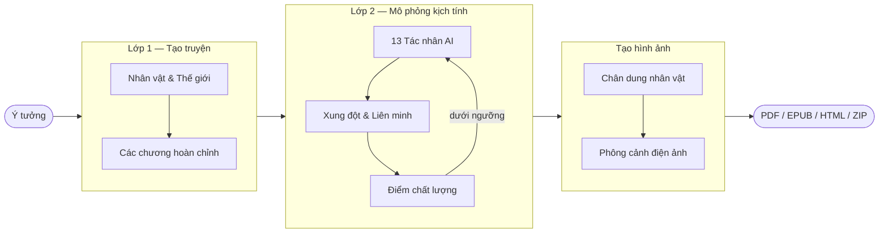

<h1 align="center">StoryForge</h1>

<p align="center">
  <strong>Nền tảng tạo truyện bằng AI với mô phỏng kịch tính đa tác nhân</strong>
</p>

<p align="center">
  <a href="https://github.com/HieuNTg/STORYFORGE/actions/workflows/ci.yml"></a>
  <a href="https://www.python.org/"></a>
  <a href="https://fastapi.tiangolo.com"></a>
  <a href="https://alpinejs.dev"></a>
  <a href="https://www.typescriptlang.org"></a>
  <a href="https://hub.docker.com"></a>
  <a href="LICENSE"></a>
  <a href="https://github.com/HieuNTg/STORYFORGE/stargazers"></a>
</p>

<p align="center">
  <a href="README.md">English</a> · <a href="https://railway.app/new/template?template=https://github.com/HieuNTg/STORYFORGE">Deploy trên Railway</a> · <a href="https://render.com/deploy?repo=https://github.com/HieuNTg/STORYFORGE">Deploy trên Render</a>
</p>

<p align="center">
  Biến một ý tưởng một câu thành câu chuyện hoàn chỉnh, giàu kịch tính với hình ảnh nhất quán nhân vật và phông cảnh điện ảnh.<br />
  Tự host. Bảo mật riêng tư. Hoạt động với mọi LLM tương thích OpenAI.
</p>

<p align="center">
  
</p>

---

## Tại sao chọn StoryForge?

Hầu hết công cụ viết AI tạo ra những câu chuyện phẳng, dễ đoán. StoryForge tiếp cận khác hơn: các nhân vật trở thành **tác nhân AI tự trị** — tranh luận, liên minh và phản bội nhau trong vòng mô phỏng kịch tính đa chiều. Mô phỏng phát lộ những xung đột mà tác giả chưa từng lên kế hoạch, rồi tự động viết lại câu chuyện xung quanh chúng cho đến khi đạt ngưỡng chất lượng.

---

## Ảnh chụp màn hình

| Tạo truyện | Cài đặt |
|:---:|:---:|
|  |  |

| Thư viện truyện | Giao diện sáng |
|:---:|:---:|
|  |  |

---

## Tính năng chính

- **Pipeline 2 lớp** — Tạo truyện → Mô phỏng kịch tính, có checkpoint & tiếp tục, streaming SSE thời gian thực
- **13 tác nhân AI chuyên biệt** — nhân vật tự trị + nhà phê bình kịch tính, tổng biên tập, phân tích nhịp điệu, kiểm tra phong cách, chuyên gia hội thoại...
- **Chấm điểm & tự sửa** — đánh giá LLM theo 4 chiều (mạch lạc, nhân vật, kịch tính, văn phong) với vòng lặp tự động nâng chất
- **Tạo hình ảnh** — chân dung nhân vật nhất quán (IP-Adapter) và phông cảnh điện ảnh, tạo sau mô phỏng kịch tính
- **Hỗ trợ đa nhà cung cấp LLM** — OpenAI, Google Gemini, Anthropic, OpenRouter (290+ model), Ollama (local), hoặc endpoint tùy chỉnh; tự nhận diện nhà cung cấp từ API key
- **Fallback đa nhà cung cấp** — cấu hình hồ sơ dự phòng tự động chuyển sang nhà cung cấp khác khi bị rate limit hoặc lỗi
- **Bộ nhớ truyện tích lũy** — kiến thức nhân vật, mối quan hệ và tuyến truyện được tích lũy xuyên suốt các chương thay vì reset, đảm bảo tính liên tục cho truyện nhiều chương
- **Tiếng Việt & Tiếng Anh** — tạo truyện song ngữ ngay từ đầu
- **Xuất phong phú** — PDF, EPUB, HTML web reader, ZIP với các chương và gợi ý hình ảnh
- **Chế độ đọc nhánh tương tác** — chọn-hướng-phiêu-lưu với các nhánh sinh bởi LLM
- **Giao diện Sáng / Tối** — chuyển đổi theme mượt mà với đồng bộ color-scheme toàn bộ trang
- **Tự host, bảo mật** — truyện và API key không bao giờ rời khỏi hạ tầng của bạn
- **Cache sẵn sàng production** — cache LLM bằng Redis cho triển khai đa worker, tự động fallback SQLite cho phát triển
- **Định tuyến model thông minh** — model rẻ cho phân tích, model cao cấp cho viết (~45% tiết kiệm chi phí)
- **Tùy chỉnh prompt tác nhân** — chỉnh sửa `data/prompts/agent_prompts.yaml` để điều chỉnh cách tác nhân AI đánh giá và nâng chất truyện

---

## Cài đặt nhanh

### Docker (khuyến nghị)

```bash
docker compose up
```

Mở [http://localhost:7860](http://localhost:7860). Xong.

### Deploy một cú nhấp

[](https://railway.app/new/template?template=https://github.com/HieuNTg/STORYFORGE)

### Cài đặt thủ công

```bash
git clone https://github.com/HieuNTg/STORYFORGE.git
cd STORYFORGE
pip install -r requirements.txt
npm install && npm run build   # biên dịch TypeScript → JS
npm run build:css              # biên dịch Tailwind CSS
python app.py
# → http://localhost:7860
```

### Lần chạy đầu tiên

1. **Cài đặt** → dán API key (tự nhận diện nhà cung cấp), chọn model
2. **Tạo truyện** → chọn thể loại, phong cách, mô tả ý tưởng một câu
3. **Chạy Pipeline** → xem quá trình tạo, mô phỏng và tạo hình ảnh stream thời gian thực
4. **Đọc** → đọc truyện hoàn chỉnh hoặc khởi động Chế độ Nhánh tương tác
5. **Xuất** → tải xuống PDF, EPUB, HTML, hoặc ZIP storyboard

---

## Cấu hình

Mọi cài đặt được quản lý qua tab **Cài đặt** trong giao diện web và lưu vào `data/config.json`. Biến môi trường chính cho triển khai Docker:

| Biến | Mô tả | Mặc định |
|:-----|:------|:---------|
| `LLM_PROVIDER` | `openai` \| `gemini` \| `anthropic` \| `openrouter` \| `ollama` | `openai` |
| `LLM_API_KEY` | API key của nhà cung cấp | _(không có)_ |
| `LLM_MODEL` | Model chính để viết (vd. `gpt-4o`) | `gpt-4o` |
| `LLM_BASE_URL` | URL endpoint tùy chỉnh (tương thích OpenAI) | _(mặc định nhà cung cấp)_ |
| `SECRET_KEY` | Bí mật session cho JWT auth | _(tự tạo)_ |
| `REDIS_URL` | Kết nối Redis cho cache production | _(fallback SQLite)_ |
| `PORT` | Cổng server | `7860` |

**Ghi đè model theo lớp** và model ngân sách thứ hai cho phân tích có thể cấu hình trong UI tại Cài đặt → Nâng cao.

### Nhà cung cấp tương thích

Bất kỳ nhà cung cấp nào cung cấp endpoint `/v1/chat/completions` tương thích OpenAI đều hoạt động với StoryForge:

**OpenAI** · **Google Gemini** · **Anthropic** · **OpenRouter** · **Ollama** · **Endpoint tùy chỉnh bất kỳ**

### Tùy chỉnh prompt tác nhân

StoryForge đi kèm 10 prompt tác nhân có thể tùy chỉnh trong `data/prompts/agent_prompts.yaml`. Chỉnh sửa file này để:
- Thay đổi ngôn ngữ đánh giá AI (mặc định: Tiếng Việt)
- Điều chỉnh tiêu chí và ngưỡng chấm điểm
- Thay đổi tính cách tác nhân và trọng tâm đánh giá

---

## Chạy ứng dụng

### Docker Compose

```bash
# Khởi động
docker compose up -d

# Xem log
docker compose logs -f

# Dừng
docker compose down
```

### Deploy một lệnh

```bash
# Railway
railway up

# Render — kết nối repo GitHub và triển khai tự động
```

---

## Kiến trúc

```
                        ┌─────────────────────────────────────────┐
  Ý tưởng người dùng ──▶│        Lớp 1 — Tạo truyện              │
                        │  Nhân vật · Thế giới · Chương · Bối cảnh│
                        └──────────────────┬──────────────────────┘
                                           │
                        ┌──────────────────▼──────────────────────┐
                        │       Lớp 2 — Mô phỏng kịch tính        │
                        │  13 Tác nhân AI · Phát lộ xung đột       │
                        │  Chấm điểm kịch tính · Vòng tự sửa      │
                        └──────────────────┬──────────────────────┘
                                           │
                        ┌──────────────────▼──────────────────────┐
                        │           Tạo hình ảnh                    │
                        │  Chân dung nhất quán · Phông cảnh điện ảnh│
                        └──────────────────┬──────────────────────┘
                                           │
                              PDF · EPUB · HTML · ZIP
```



---

## Công nghệ sử dụng

| Lớp | Công nghệ |
|:----|:----------|
| Backend | Python 3.10+, FastAPI, Uvicorn |
| Frontend | Alpine.js 3, TypeScript, Tailwind CSS |
| Streaming | Server-Sent Events (SSE) |
| AI / LLM | API tương thích OpenAI bất kỳ |
| Tạo hình ảnh | IP-Adapter (nhất quán nhân vật), diffusion models (phông cảnh) |
| Lưu trữ | JSON files, SQLite (cache dev), Redis (cache production) |
| Xuất | fpdf2 (PDF), ebooklib (EPUB) |
| Auth & Bảo mật | JWT, rate limiting, RBAC, CSRF, audit logging, XSS sanitization (nh3) |
| Giám sát | Prometheus, Grafana, Loki |
| Container | Docker, Docker Compose |
| CI/CD | GitHub Actions |

---

## Cấu trúc dự án

```
storyforge/
├── app.py                      # Điểm vào FastAPI
├── mcp_server.py               # MCP tool server
├── pipeline/                   # Engine tạo 2 lớp
│   ├── orchestrator.py         #   Orchestrator với checkpoint
│   ├── layer1_story/           #   Tạo truyện (nhân vật, thế giới, chương)
│   ├── layer2_enhance/         #   Mô phỏng kịch tính & nâng chất
│   └── agents/                 #   13 tác nhân AI chuyên biệt
├── services/                   # Logic nghiệp vụ tái sử dụng
│   ├── llm/                    #   LLM client với provider abstraction & fallback
│   ├── llm_cache.py            #   Cache hai backend (Redis / SQLite)
│   ├── pipeline/               #   Chấm điểm, đọc nhánh, sửa thông minh
│   ├── media/                  #   Tạo hình ảnh (chân dung, phông cảnh)
│   ├── export/                 #   Xuất PDF, EPUB, HTML, Wattpad
│   ├── auth/                   #   JWT, quản lý người dùng, thu hồi token
│   ├── infra/                  #   Database, i18n, metrics, structured logging
│   └── ...                     #   Analytics, feedback, onboarding, v.v.
├── api/                        # REST endpoint FastAPI
│   ├── pipeline_routes.py      #   Pipeline SSE streaming + tiếp tục
│   ├── config_routes.py        #   Settings CRUD + kiểm tra kết nối
│   ├── export_routes.py        #   Xuất PDF, EPUB, ZIP
│   └── ...                     #   Auth, analytics, health, metrics, v.v.
├── web/                        # Frontend Alpine.js (SPA)
│   ├── index.html              #   Ứng dụng chính
│   ├── js/                     #   TypeScript source → biên dịch qua tsc
│   └── css/                    #   Tailwind CSS + style tùy chỉnh
├── config/                     # Package cấu hình
├── data/prompts/               # Prompt tác nhân có thể tùy chỉnh (YAML)
├── middleware/                  # Auth, RBAC, rate limiting, CSRF, audit logging
├── models/                     # Mô hình dữ liệu Pydantic
├── monitoring/                 # Prometheus, Grafana, Loki configs
├── plugins/                    # Hệ thống plugin
├── tests/                      # Bộ kiểm tra (unit, integration, security, load)
└── scripts/                    # Script tiện ích
```

---

## Đóng góp

Đóng góp luôn được chào đón! Vui lòng đọc [CONTRIBUTING.md](CONTRIBUTING.md) để bắt đầu — bao gồm cài đặt môi trường phát triển, quy chuẩn code, quy trình PR và cách tìm vấn đề phù hợp cho người mới.

---

## Giấy phép

[MIT](LICENSE) — Bản quyền 2026 StoryForge Contributors

---

## Lời cảm ơn

StoryForge được xây dựng trên nền tảng các dự án mã nguồn mở xuất sắc:

- [FastAPI](https://fastapi.tiangolo.com) — web framework Python hiện đại
- [Alpine.js](https://alpinejs.dev) — frontend reactive nhẹ
- [Tailwind CSS](https://tailwindcss.com) — CSS tiện ích
- [fpdf2](https://py-pdf.github.io/fpdf2/) — tạo PDF
- [ebooklib](https://github.com/aerkalov/ebooklib) — tạo EPUB
- Tất cả nhà cung cấp LLM — OpenAI, Google, Anthropic, OpenRouter, và cộng đồng Ollama
