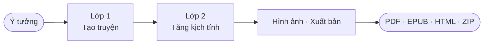

<h1 align="center">StoryForge</h1>

<p align="center">
  <strong>Nền tảng tạo truyện bằng AI với mô phỏng kịch tính đa tác nhân</strong>
</p>

<p align="center">
  <a href="https://www.python.org/"></a>
  <a href="https://fastapi.tiangolo.com"></a>
  <a href="https://alpinejs.dev"></a>
  <a href="https://www.typescriptlang.org"></a>
  <a href="LICENSE"></a>
  <a href="https://github.com/HieuNTg/STORYFORGE/stargazers"></a>
</p>

<p align="center">
  <a href="README.md">English</a>
</p>

<p align="center">
  Biến một câu ý tưởng thành tiểu thuyết mạng tiếng Việt hoàn chỉnh, giàu kịch tính với hình ảnh nhất quán nhân vật và phông cảnh điện ảnh.<br />
  Tự host. Bảo mật riêng tư. Hoạt động với mọi LLM tương thích OpenAI.
</p>

<p align="center">
  
</p>

---

## Tại sao chọn StoryForge?

Hầu hết công cụ viết AI tạo ra những câu chuyện phẳng, dễ đoán. StoryForge tiếp cận khác hơn: các nhân vật trở thành **tác nhân AI tự trị** — tranh luận, liên minh và phản bội nhau trong vòng mô phỏng kịch tính đa chiều. Mô phỏng phát lộ những xung đột mà tác giả chưa từng lên kế hoạch, rồi tự động viết lại câu chuyện xung quanh chúng cho đến khi đạt ngưỡng chất lượng.

---

## Ảnh chụp màn hình

| Tạo truyện | Cài đặt |
|:---:|:---:|
|  |  |

| Thư viện truyện | Giao diện sáng |
|:---:|:---:|
|  |  |

---

## Tính năng chính

### Engine Truyện
- **Pipeline 2 lớp** — Tạo truyện → Mô phỏng kịch tính, có checkpoint & tiếp tục, streaming SSE thời gian thực
- **13 tác nhân AI chuyên biệt** — nhân vật tự trị + nhà phê bình kịch tính, tổng biên tập, phân tích nhịp điệu, kiểm tra phong cách, chuyên gia hội thoại, reader simulator...
- **Chấm điểm & tự sửa** — đánh giá LLM theo 6 chiều (mạch lạc, nhân vật, kịch tính, văn phong, chiều sâu chủ đề, chất lượng hội thoại) với vòng lặp tự động nâng chất
- **Bộ nhớ truyện tích lũy** — kiến thức nhân vật, mối quan hệ và tuyến truyện tích lũy xuyên chương thay vì reset, đảm bảo liên tục cho truyện nhiều chương
- **Quy tắc đặt tên theo thể loại** — tên Việt mặc định; phong cách Trung (tiên hiệp/kiếm hiệp/tu tiên/wuxia/xianxia) và Fantasy phương Tây/Sci-Fi tự chọn theo genre
- **Arc scaling** — cột mốc cung nhân vật tự scale theo `num_chapters` để nhịp phát triển nhân vật phù hợp truyện ngắn hay dài
- **RAG knowledge base** — truy xuất ngữ cảnh xây dựng thế giới qua ChromaDB + sentence-transformers; tải file `.txt`, `.md`, hoặc `.pdf` tham khảo để làm giàu nội dung truyện

### Tiếp Tục Truyện Nâng Cao
- **Tiếp tục truyện** — thêm chương mới vào truyện đã lưu từ checkpoint, tùy chỉnh số chương và số từ; tùy chọn chạy lại Layer 2 nâng chất toàn bộ truyện
- **Xem trước đa hướng** — xem trước 2-5 hướng phát triển khác nhau với tóm tắt và outline; click để chọn và viết
- **Trình biên tập outline** — tạo outline chương trước, chỉnh sửa tiêu đề và tóm tắt inline, rồi viết từ outline đã duyệt
- **Viết chương cộng tác** — tự viết nội dung chương, sau đó để AI polish với 3 mức độ (nhẹ/trung bình/nặng)
- **Kiểm tra nhất quán** — quét truyện tìm mâu thuẫn về nhân vật, dòng thời gian, sự kiện và địa điểm; xem issues với mức nghiêm trọng và gợi ý sửa
- **Điều hướng cung nhân vật** — hướng dẫn quỹ đạo phát triển nhân vật qua các chương mới
- **Chèn chương** — chèn chương mới giữa truyện với đánh số lại tự động
- **Tái tạo chương chọn lọc** — tái tạo chương cụ thể mà không ảnh hưởng chương khác
- **Sửa nhất quán hồi tố** — tự động sửa lỗi liên tục trong chương trước khi chương mới gây ra thay đổi

### Layer 1 — Chất Lượng Tạo Truyện
- **Hợp đồng chương** — yêu cầu từng chương với xác thực và lan truyền lỗi
- **Mốc cung nhân vật** — cột mốc cung nhân vật với xác thực
- **Bộ nhớ vòng cung nhân vật** — cache trạng thái cung nhân vật để truy xuất nhanh xuyên chương
- **Chèn hội thoại** — chèn hội thoại tự nhiên và xác thực giọng nhất quán
- **Hệ thống ngữ cảnh phân tầng** — quản lý ngữ cảnh 4 cấp ưu tiên cho truyện dài (đầy đủ/tóm tắt/điểm chính/tối thiểu)
- **Liên kết tường thuật** — phụ thuộc tuyến, báo trước ngữ nghĩa, theo dõi leo thang xung đột
- **Vòng phản hồi** — sửa nhịp điệu, xác thực địa điểm, phê bình chọn lọc
- **Kiểm soát nhịp độ** — điều chỉnh tốc độ kể chuyện và phân bổ sự kiện giữa các chương
- **Tự phê bình** — tự đánh giá và sửa lỗi nội dung trước khi hoàn thành chương
- **Bộ nhớ cảm xúc** — theo dõi trạng thái cảm xúc nhân vật xuyên chương
- **Đồ thị nhân quả** — theo dõi quan hệ nhân-quả để đảm bảo tính nhất quán cốt truyện

### Layer 2 — Chất Lượng Mô Phỏng Kịch Tính
- **Cổng hợp đồng** — xác thực từng chương với viết lại một lần khi thất bại
- **Xử lý song song** — mô phỏng nhiều tác nhân đồng thời để tăng tốc độ
- **Kiểm tra trước tính nhất quán** — xác thực nội dung trước khi chạy mô phỏng đầy đủ
- **Ràng buộc kiến thức** — giới hạn kiến thức tác nhân theo ngữ cảnh câu chuyện
- **Độ khẩn tuyến** — theo dõi áp lực tâm lý được nối vào hành vi tác nhân
- **Trách nhiệm nhân quả** — sự kiện tiết lộ, lan truyền chứng nhân, trail kiểm toán LLM
- **Ngữ cảnh tri thức** — prompt tác nhân được làm giàu với định dạng chuỗi nhân quả
- **Tín hiệu chất lượng không chi phí** — phát hiện tuyến cũ, hook chương, theo dõi cung cảm xúc

### L3 Đánh Bóng Giác Quan (tùy chọn)
- **Làm giàu giác quan** — bổ sung chi tiết thị giác, thính giác, xúc giác cho cảnh
- **Hậu xử lý nâng cao** — đánh bóng văn phong sau khi hoàn thành Layer 2

### Mô Phỏng Độc Giả
- **Phản hồi chất lượng** — mô phỏng phản ứng độc giả để đánh giá tác động truyện
- **Phân tích trải nghiệm đọc** — đo lường sự hấp dẫn và điểm yếu từ góc nhìn người đọc

### Đọc Nhánh Tương Tác
- **Chọn-hướng-phiêu-lưu** — các nhánh sinh bởi LLM với streaming SSE thời gian thực và hiệu ứng text sống động
- **Cây SVG tương tác** — bản đồ cây tất cả nhánh với điều hướng goto-node bấm được
- **Undo/Redo** — điều hướng qua lại lịch sử lựa chọn với bảo toàn trạng thái đầy đủ
- **Bookmarks** — lưu và nhảy đến bất kỳ node nào trong cây; bookmark lưu trữ xuyên phiên
- **Analytics nhánh** — theo dõi lượt truy cập, số path đã khám phá, lựa chọn phổ biến, phân bố độ sâu
- **Minimap zoom/pan** — xem toàn cảnh cây với điều khiển zoom và chỉ báo vị trí hiện tại
- **Cộng tác WebSocket** — phiên đa người dùng thời gian thực với số user online và điều hướng đồng bộ
- **Xuất EPUB** — tải toàn bộ cây nhánh dưới dạng EPUB với tất cả các đường
- **Gộp nhánh** — gộp các nhánh phân kỳ với phát hiện và giải quyết xung đột
- **Giới hạn 10 tầng sâu** — tự động tạo kết thúc khi đạt độ sâu tối đa
- **Lưu phiên** — trạng thái đọc nhánh lưu vào localStorage, giữ nguyên khi tải lại trang
- **Chọn chương** — tải bất kỳ truyện nào từ pipeline hiện tại hoặc checkpoint đã lưu vào chế độ nhánh

### Hình Ảnh & Xuất
- **Tạo hình ảnh** — chân dung nhân vật nhất quán (IP-Adapter) và phông cảnh điện ảnh, tạo sau mô phỏng kịch tính
- **Xuất phong phú** — PDF, EPUB, HTML web reader, ZIP với các chương và gợi ý hình ảnh

### LLM & Nhà Cung Cấp
- **Hỗ trợ đa nhà cung cấp LLM** — OpenAI, Google Gemini, Anthropic, OpenRouter (290+ model), Z.AI (model miễn phí), Kyma API, Ollama (local), hoặc endpoint tùy chỉnh; tự nhận diện nhà cung cấp từ API key
- **Chuyển đổi rate-limit chủ động** — theo dõi hạn ngạch provider theo thời gian thực; chain tự chuyển sang model kế tiếp *trước khi* dính 429, dùng timing từ reset header để xếp hàng retry
- **Chờ-và-thử-lại cấp chain** — khi toàn bộ chuỗi fallback hết quota, request sẽ chờ đến lần reset sớm nhất thay vì lỗi luôn
- **Định tuyến primary theo latency** — model chính chậm sẽ được retry thay vì bị bỏ qua âm thầm, tránh chain rỗng khi mạng chậm tạm thời
- **Định tuyến model theo provider** — tự động điều chỉnh định dạng model cho từng provider trong chuỗi fallback
- **Hỗ trợ auto-router** — để hệ thống chọn model tốt nhất cho từng tác vụ dựa trên đánh đổi chi phí/năng lực
- **Định tuyến model thông minh** — model rẻ cho phân tích, model cao cấp cho viết (~45% tiết kiệm chi phí)
- **Cache LLM tích hợp** — cache SQLite tránh gọi API lặp lại

### Giao Diện & Trải Nghiệm
- **Redesign toàn bộ SPA (v2.3)** — cả 7 trang được build lại trên hệ thống `sf-*` thống nhất: hero viền gradient, step badges, empty-state heroes, story cards, stat tiles, guide steps
- **Bảng màu Swiss Modernism** — brand `#2563EB` · violet `#8B5CF6` · cam `#F97316` · emerald done `#10B981`, tối ưu tương phản cả hai theme
- **Copy tiếng Việt** — mọi trang, button, empty state và toast đều được Việt hoá; chỉ giữ tiếng Anh cho tên provider và biến môi trường
- **Tạo Truyện** — pipeline 6 giai đoạn trực quan, composer ý tưởng có đếm ký tự live, config slider (chương · nhân vật · từ · mức kịch tính), và lưu form state vào `localStorage`
- **Thư viện** — tìm kiếm live, action continue/delete inline, badge layer (Draft / Enhanced / Complete)
- **Đọc truyện** — typography tập trung, hiển thị ảnh inline, sidebar điều hướng chương
- **Phân tích** — dashboard mô phỏng với 4 stat tile và 4 meter chất lượng (mạch lạc, nhân vật, kịch tính, văn phong)
- **Phân nhánh** — picker chọn nguồn (truyện đang mở hoặc đã lưu) với cây tương tác
- **Cài đặt** — Quick Setup preset cards (Basic / Optimized / Max Context), grid chọn provider, toggle tạo ảnh
- **Hướng dẫn** — sơ đồ pipeline với card Layer 1 & Layer 2 và 5 bước onboarding
- **Sáng / Tối** — toggle theme mượt, đồng bộ color-scheme toàn app; Heroicons SVG xuyên suốt

### Bảo Mật & Hạ Tầng
- **Bảo vệ CSRF** — double-submit cookie pattern cho mọi request thay đổi trạng thái
- **Giới hạn body** — payload request tối đa 10 MB
- **Chặn prompt injection** — middleware phát hiện và chặn các mẫu injection trong JSON payload
- **Mã hóa secrets** — API key được mã hóa trong `data/secrets.json` (yêu cầu `STORYFORGE_SECRET_KEY`)
- **Tự host, bảo mật** — truyện và API key không bao giờ rời khỏi hạ tầng của bạn
- **Tùy chỉnh prompt tác nhân** — chỉnh sửa `data/prompts/agent_prompts.yaml` để điều chỉnh cách tác nhân AI đánh giá và nâng chất truyện

---

## Cài đặt nhanh

```bash
git clone https://github.com/HieuNTg/STORYFORGE.git
cd STORYFORGE
pip install -r requirements.txt
npm install && npm run build   # biên dịch TypeScript → JS
npm run build:css              # biên dịch Tailwind CSS
python app.py
# → http://localhost:7860
```

### Lần chạy đầu tiên

1. **Cài đặt** → wizard hướng dẫn chọn nhà cung cấp, nhập API key, chọn model — tự động kiểm tra kết nối
2. **Tạo truyện** → chọn thể loại, phong cách, mô tả ý tưởng một câu
3. **Chạy Pipeline** → xem quá trình tạo, mô phỏng và tạo hình ảnh stream thời gian thực
4. **Tiếp tục** → thêm chương mới vào bất kỳ truyện đã lưu từ checkpoint
5. **Đọc nhánh** → khám phá nhánh tương tác với cây SVG trực quan
6. **Xuất** → tải xuống PDF, EPUB, HTML, hoặc ZIP storyboard

---

## Triển khai & Mở rộng

### Biến môi trường

| Biến | Mặc định | Mô tả |
|------|----------|-------|
| `STORYFORGE_SECRET_KEY` | _(dựa trên file)_ | Khóa ký HMAC. Kích hoạt mã hóa secrets. **Bắt buộc đặt trong production.** |
| `REDIS_URL` | _(không có)_ | Redis URL cho cache + session. Bắt buộc khi chạy nhiều instance. |
| `NUM_WORKERS` | `1` | Số worker Uvicorn. Tăng theo số CPU core. |
| `STORYFORGE_ALLOWED_ORIGINS` | `localhost:7860` | CORS origins (phân cách bằng dấu phẩy). |
| `TRUSTED_PROXY_IPS` | _(không có)_ | IP proxy tin cậy cho X-Forwarded-For. |
| `DB_POOL_SIZE` | `5` | Kích thước connection pool SQLAlchemy. |
| `STORYFORGE_BLOCK_INJECTION` | `true` | Chặn các prompt injection bị phát hiện. |
| `CHROMA_PERSIST_DIR` | `data/chroma` | Thư mục lưu trữ ChromaDB cho RAG knowledge base. |
| `CHROMA_COLLECTION_NAME` | `storyforge` | Tên collection ChromaDB. |

### Một instance (mặc định)
Hoạt động ngay với SQLite cache. Không cần Redis.

### Nhiều instance
Yêu cầu Redis để chia sẻ cache và trạng thái session:
```bash
REDIS_URL=redis://localhost:6379 NUM_WORKERS=4 python app.py
```

> ⚠️ Không có Redis, mỗi worker có cache in-memory riêng — session sẽ không được chia sẻ.

---

## Cấu hình

Mọi cài đặt được quản lý qua tab **Cài đặt** trong giao diện web và lưu vào `data/config.json`. Biến môi trường chính:

| Biến | Mô tả | Mặc định |
|:-----|:------|:---------|
| `LLM_PROVIDER` | `openai` \| `gemini` \| `anthropic` \| `openrouter` \| `ollama` | `openai` |
| `LLM_API_KEY` | API key của nhà cung cấp | _(không có)_ |
| `LLM_MODEL` | Model chính để viết (vd. `gpt-4o`) | `gpt-4o` |
| `LLM_BASE_URL` | URL endpoint tùy chỉnh (tương thích OpenAI) | _(mặc định nhà cung cấp)_ |
| `PORT` | Cổng server | `7860` |

**Ghi đè model theo lớp** và model ngân sách thứ hai cho phân tích có thể cấu hình trong UI tại Cài đặt → Nâng cao.

### Nhà cung cấp tương thích

Bất kỳ nhà cung cấp nào cung cấp endpoint `/v1/chat/completions` tương thích OpenAI đều hoạt động với StoryForge:

**OpenAI** · **Google Gemini** · **Anthropic** · **OpenRouter** · **Z.AI** · **Kyma API** · **Ollama** · **Endpoint tùy chỉnh bất kỳ**

### Tùy chỉnh prompt tác nhân

StoryForge đi kèm 10 prompt tác nhân có thể tùy chỉnh trong `data/prompts/agent_prompts.yaml`. Chỉnh sửa file này để:
- Thay đổi ngôn ngữ đánh giá AI (mặc định: Tiếng Việt)
- Điều chỉnh tiêu chí và ngưỡng chấm điểm
- Thay đổi tính cách tác nhân và trọng tâm đánh giá

---

## Kiến trúc



- **Lớp 1** xây dựng nhân vật, outline, conflict web, foreshadowing rồi viết chương song song theo batch.
- **Lớp 2** chạy mô phỏng kịch tính đa tác nhân, viết lại cảnh với bảo toàn giọng văn và validate chapter contract.
- **Quality gate, rewrite cấu trúc, và vòng smart revision** tự động kích hoạt giữa các lớp để bắt chương yếu.

Xem [**docs/system-architecture.md**](docs/system-architecture.md) để biết luồng pipeline đầy đủ, tích hợp tín hiệu L1↔L2, và semantics retry.

---

## Công nghệ sử dụng

| Lớp | Công nghệ |
|:----|:----------|
| Backend | Python 3.10+, FastAPI, Uvicorn |
| Frontend | Alpine.js 3, TypeScript, Tailwind CSS |
| Streaming | Server-Sent Events (SSE) |
| AI / LLM | API tương thích OpenAI bất kỳ |
| RAG | ChromaDB, sentence-transformers (tùy chọn) |
| Tạo hình ảnh | IP-Adapter (nhất quán nhân vật), diffusion models (phông cảnh) |
| Lưu trữ | JSON files, SQLite (cache dev), Redis (cache production) |
| Xuất | fpdf2 (PDF), ebooklib (EPUB) |

---

## Cấu trúc dự án

```
storyforge/
├── app.py                      # Điểm vào FastAPI
├── mcp_server.py               # MCP tool server
├── pipeline/                   # Engine tạo 2 lớp
│   ├── orchestrator.py         #   Orchestrator với checkpoint
│   ├── layer1_story/           #   Tạo truyện (nhân vật, thế giới, chương)
│   ├── layer2_enhance/         #   Mô phỏng kịch tính & nâng chất
│   └── agents/                 #   13 tác nhân AI chuyên biệt
├── services/                   # Logic nghiệp vụ tái sử dụng
│   ├── llm/                    #   LLM client với provider abstraction & fallback
│   ├── llm_cache.py            #   Cache hai backend (Redis / SQLite)
│   ├── rag_knowledge_base.py   #   Truy xuất ngữ cảnh RAG (ChromaDB)
│   ├── pipeline/               #   Chấm điểm, đọc nhánh, sửa thông minh
│   ├── media/                  #   Tạo hình ảnh (chân dung, phông cảnh)
│   ├── export/                 #   Xuất PDF, EPUB, HTML, Wattpad
│   ├── infra/                  #   Database, i18n, structured logging
│   └── ...                     #   Analytics, feedback, onboarding, v.v.
├── api/                        # REST endpoint FastAPI
│   ├── pipeline_routes.py      #   Pipeline SSE streaming + tiếp tục
│   ├── continuation_routes.py  #   Tiếp tục truyện với chương mới
│   ├── branch_routes.py        #   API đọc nhánh tương tác
│   ├── config_routes.py        #   Settings CRUD + kiểm tra kết nối
│   ├── export_routes.py        #   Xuất PDF, EPUB, ZIP
│   └── ...                     #   Analytics, health, metrics, v.v.
├── web/                        # Frontend Alpine.js (SPA)
│   ├── index.html              #   Ứng dụng chính
│   ├── js/                     #   TypeScript source → biên dịch qua tsc
│   └── css/                    #   Tailwind CSS + style tùy chỉnh
├── config/                     # Package cấu hình
├── data/prompts/               # Prompt tác nhân có thể tùy chỉnh (YAML)
├── models/                     # Mô hình dữ liệu Pydantic
├── plugins/                    # Hệ thống plugin
├── tests/                      # Bộ kiểm tra (unit, integration, security, load)
└── scripts/                    # Script tiện ích
```

---

## Đóng góp

Đóng góp luôn được chào đón! Vui lòng đọc [CONTRIBUTING.md](CONTRIBUTING.md) để bắt đầu — bao gồm cài đặt môi trường phát triển, quy chuẩn code, quy trình PR và cách tìm vấn đề phù hợp cho người mới.

---

## Giấy phép

[MIT](LICENSE) — Bản quyền 2026 StoryForge Contributors

---

## Lời cảm ơn

StoryForge được xây dựng trên nền tảng các dự án mã nguồn mở xuất sắc:

- [FastAPI](https://fastapi.tiangolo.com) — web framework Python hiện đại
- [Alpine.js](https://alpinejs.dev) — frontend reactive nhẹ
- [Tailwind CSS](https://tailwindcss.com) — CSS tiện ích
- [fpdf2](https://py-pdf.github.io/fpdf2/) — tạo PDF
- [ebooklib](https://github.com/aerkalov/ebooklib) — tạo EPUB
- Tất cả nhà cung cấp LLM — OpenAI, Google, Anthropic, OpenRouter, và cộng đồng Ollama
