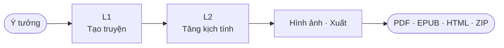

<h1 align="center">StoryForge</h1>

<p align="center"><strong>Tạo truyện bằng AI với mô phỏng kịch tính đa tác nhân</strong></p>

<p align="center">
  <a href="https://www.python.org/"></a>
  <a href="https://fastapi.tiangolo.com"></a>
  <a href="LICENSE"></a>
  <a href="README.md">English</a>
</p>

<p align="center">
  Biến một câu ý tưởng thành tiểu thuyết mạng tiếng Việt hoàn chỉnh, giàu kịch tính — kèm hình ảnh nhân vật nhất quán, phông cảnh điện ảnh, dùng được mọi LLM tương thích OpenAI. Tự host.
</p>

<p align="center">
  
</p>

---

## Tại sao

Hầu hết công cụ viết AI cho ra truyện phẳng. StoryForge biến mỗi nhân vật thành **tác nhân tự trị** — tranh luận, liên minh, phản bội trong vòng mô phỏng đa tác nhân — phát lộ xung đột tác giả chưa từng lên kế hoạch, rồi tự viết lại quanh chúng cho đến khi đạt ngưỡng chất lượng.

---

## Cài đặt nhanh

```bash
git clone https://github.com/HieuNTg/STORYFORGE.git
cd STORYFORGE
pip install -r requirements.txt
npm install && npm run build && npm run build:css
python app.py            # → http://localhost:7860
```

Sau đó **Cài đặt** (provider + API key) → **Tạo truyện** → **Chạy** → **Xuất** (PDF/EPUB/HTML/ZIP).

---

## Tính năng

- **Pipeline 2 lớp** — L1 tạo truyện → L2 mô phỏng kịch tính, có checkpoint, SSE streaming, L3 đánh bóng giác quan tuỳ chọn
- **13 tác nhân chuyên biệt** — drama critic, editor, pacing, dialogue, reader simulator, …; chấm 6 chiều + tự sửa bằng LLM-as-judge
- **Tiếng Việt mặc định** — tên VN; tuỳ chọn phong cách Trung (tiên hiệp / kiếm hiệp / tu tiên / wuxia / xianxia) và Fantasy phương Tây / Sci-Fi; arc scale theo số chương
- **Tiếp tục truyện** — preview đa hướng, outline editor, viết cộng tác, kiểm tra nhất quán, chèn chương giữa truyện, sửa hồi tố
- **Branch reader** — CYOA do LLM sinh, cây SVG + minimap, undo/redo, bookmarks, WebSocket multi-user, xuất EPUB cây
- **Hình ảnh** — chân dung IP-Adapter nhất quán + phông cảnh điện ảnh
- **Mọi LLM tương thích OpenAI** — OpenAI, Gemini, Anthropic, OpenRouter (290+), Z.AI, Kyma, Ollama, custom; rate-limit switch chủ động, primary theo latency, định tuyến cheap/premium (~45% tiết kiệm), cache SQLite
- **Bảo mật** — CSRF double-submit, body cap 10 MB, middleware chặn prompt injection, mã hoá secrets at-rest

---

## Cấu hình

Tab Cài đặt lưu vào `data/config.json`. Biến môi trường chính:

| Biến | Mục đích |
|------|----------|
| `LLM_PROVIDER` / `LLM_API_KEY` / `LLM_MODEL` | nhà cung cấp, key, model chính |
| `STORYFORGE_SECRET_KEY` | khoá HMAC — **bắt buộc đặt trong production** để mã hoá secrets |
| `REDIS_URL` | bắt buộc khi chạy nhiều instance (`NUM_WORKERS>1`) — chia sẻ cache/session |
| `STORYFORGE_ALLOWED_ORIGINS` | CORS origins (phân cách bằng phẩy) |
| `STORYFORGE_HANDOFF_STRICT` | `1` = fail-fast khi tín hiệu L1→L2 malformed (mặc định: warn) |
| `STORYFORGE_SEMANTIC_STRICT` | `1` = fail-fast khi foreshadowing không có payoff (mặc định: warn) |
| `CHROMA_PERSIST_DIR` / `CHROMA_COLLECTION_NAME` | persistence cho RAG |

Override model theo lớp, drama ceiling, batch size, voice-revert anchoring, … nằm trong `config/defaults.py` (`PipelineConfig`) và tab Cài đặt. Prompt tác nhân chỉnh trong `data/prompts/agent_prompts.yaml`.

### Test marker

```bash
pytest tests/ -v -m "not calibration and not bench"   # subset chạy nhanh
pytest tests/ -v -m calibration                       # calibration model thật
```

---

## Kiến trúc



Tín hiệu L1→L2: `conflict_web` + `foreshadowing_plan` chảy vào simulator; `arc_waypoints` + `threads` đi vào analyzer/enhancer; `voice_fingerprints` giữ giọng nhân vật xuyên các lượt rewrite L2.

Xem [`docs/system-architecture.md`](docs/system-architecture.md) cho luồng đầy đủ.

---

## Sprint gần đây (5/2026)

- **[Sprint 1](docs/adr/0001-l1-handoff-envelope.md)** — Envelope `L1Handoff` typed + `NegotiatedChapterContract` (Pydantic v2, frozen) thay pattern silent-empty `getattr` ở seam L1→L2. `STORYFORGE_HANDOFF_STRICT=1` cho fail-fast.
- **[Sprint 2](docs/adr/0002-semantic-verification.md)** — Embedding CPU local (`paraphrase-multilingual-MiniLM-L12-v2`) + spaCy NER thay 3 kiểm tra keyword. Ngưỡng `0.55` đạt 96.67% trên 30 cặp calibration tiếng Việt. `STORYFORGE_SEMANTIC_STRICT=1`.
- **[Sprint 3](docs/adr/0003-generation-hardening-drama-ceiling.md)** — Drama ceiling nối vào prompt chương; voice revert chuyển positional → speaker-anchored `(speaker_id, ordinal)` chuẩn NFC; hợp đồng async D3 (sync wrapper raise khi event loop đang chạy); structural rewriter batched sau `asyncio.Semaphore`.

Plan dir từng sprint trong [`plans/`](plans/README.md).

---

## Tài liệu

- [`docs/`](docs/README.md) — index đầy đủ (kiến trúc, code standards, deployment)
- [`docs/adr/`](docs/adr/) — architecture decision records
- [CONTRIBUTING.md](CONTRIBUTING.md) — cài đặt dev, code style, quy trình PR

---

## Giấy phép

[MIT](LICENSE) — Bản quyền 2026 StoryForge Contributors
