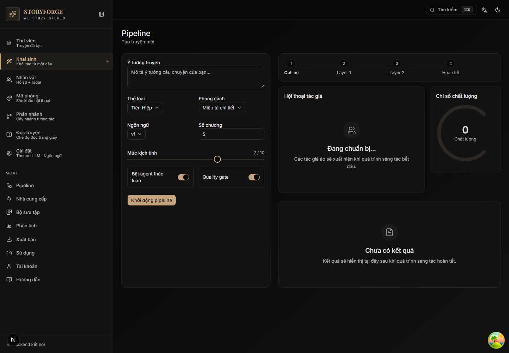
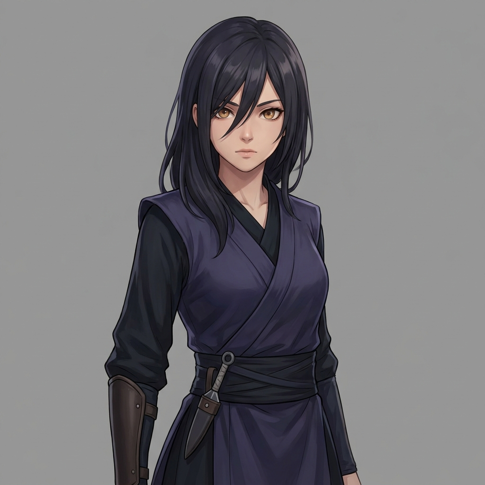

<h1 align="center">StoryForge</h1>

<p align="center"><strong>Tạo truyện bằng AI với mô phỏng kịch tính đa tác nhân</strong></p>

<p align="center">
  <a href="https://www.python.org/"></a>
  <a href="https://fastapi.tiangolo.com"></a>
  <a href="LICENSE"></a>
  <a href="README.md">English</a>
</p>

<p align="center">
  Biến một câu ý tưởng thành tiểu thuyết mạng tiếng Việt hoàn chỉnh, giàu kịch tính — kèm hình ảnh nhân vật nhất quán, phông cảnh điện ảnh, dùng được mọi LLM tương thích OpenAI. Tự host.
</p>

<p align="center">
  
</p>

---

## Tại sao

Hầu hết công cụ viết AI cho ra truyện phẳng. StoryForge biến mỗi nhân vật thành **tác nhân tự trị** — tranh luận, liên minh, phản bội trong vòng mô phỏng đa tác nhân — phát lộ xung đột tác giả chưa từng lên kế hoạch, rồi tự viết lại quanh chúng cho đến khi đạt ngưỡng chất lượng.

---

## Ảnh minh hoạ

Do chính pipeline sinh ra — **chân dung nhân vật nhất quán** (cùng một gương mặt xuyên suốt mọi chương) kèm **phông cảnh điện ảnh**, cho một truyện tiên hiệp tiếng Việt. Tất cả render local miễn phí.

<table>
  <tr>
    <td align="center" width="33%"><br/><sub><b>Triệu Thiên Phong</b> · nam chính</sub></td>
    <td align="center" width="33%"><br/><sub><b>Tiểu Vũ</b> · nữ chính</sub></td>
    <td align="center" width="33%"><br/><sub><b>Hắc Phong Lão Tổ</b> · phản diện</sub></td>
  </tr>
</table>

<p align="center">
  <br/>
  <sub>Phông cảnh — vẫn các nhân vật đó, giữ nhất quán qua từng chương · <a href="#tạo-hình-ảnh">cách thiết lập ↓</a></sub>
</p>

---

## Cài đặt nhanh

```bash
git clone https://github.com/HieuNTg/STORYFORGE.git
cd STORYFORGE
pip install -r requirements.txt
cd frontend && npm install && cd ..

# Windows PowerShell: tự mở backend + frontend trong hai cửa sổ
./dev.ps1
```

Vẫn có thể chạy thủ công: `python app.py` cho API (`:7860`) và `cd frontend && npm run dev -- --port 3001` cho UI (`:3001`).

Sau đó mở **http://localhost:3001/forge/** → **Cài đặt → Khóa API** (thêm provider + chọn model) → **Khai sinh** → **Chạy** → **Thư viện / Đọc truyện / Phân nhánh / Mô phỏng** → **Xuất** (PDF/EPUB/HTML/ZIP).

---

## Tính năng

- **Pipeline 2 lớp** — L1 tạo truyện → L2 mô phỏng kịch tính, có checkpoint, SSE streaming, L3 đánh bóng giác quan tuỳ chọn
- **13 tác nhân chuyên biệt** — drama critic, editor, pacing, dialogue, reader simulator, …; chấm 6 chiều + tự sửa bằng LLM-as-judge
- **Tiếng Việt mặc định** — tên VN; tuỳ chọn phong cách Trung (tiên hiệp / kiếm hiệp / tu tiên / wuxia / xianxia) và Fantasy phương Tây / Sci-Fi; arc scale theo số chương
- **Tiếp tục truyện** — preview đa hướng, outline editor, viết cộng tác, kiểm tra nhất quán, chèn chương giữa truyện, sửa hồi tố
- **Luồng dựa trên thư viện local** — Đọc truyện, Phân nhánh, Mô phỏng và Nhân vật đều bắt đầu bằng chọn truyện đã lưu trong thư viện; không dùng session giả `demo` hoặc text rời rạc.
- **Branch reader** — CYOA do LLM sinh, cây SVG + minimap, undo/redo, bookmarks, WebSocket multi-user, xuất EPUB cây
- **Hình ảnh nhân vật nhất quán** — cùng một gương mặt xuyên suốt mọi chương (consistency bằng ảnh tham chiếu / IP-Adapter) cùng phông cảnh điện ảnh. Sinh local miễn phí qua HuggingFace FLUX hoặc [FlowKit](docs/flowkit-integration.md) (Imagen 3, chỉ local — rủi ro cấm tài khoản, dùng tài khoản Google phụ); trả phí qua DALL·E / Seedream. Xem [Ảnh minh hoạ](#ảnh-minh-hoạ) và [bảng thiết lập bên dưới](#tạo-hình-ảnh).
- **Provider profile + dropdown model** — Cài đặt có thẻ thêm nhanh cho Gemini, Anthropic, OpenAI, OpenRouter Free, Z.AI và Kyma. Model được chọn bằng dropdown (Gemini/Gemma, OpenRouter free text models, OpenAI/Anthropic, fallback GLM/Qwen/DeepSeek); cheap/L1/L2 cũng chọn từ provider đã cấu hình thay vì nhập tay.
- **Mọi LLM tương thích OpenAI** — OpenAI, Gemini, Anthropic, OpenRouter, Z.AI, Kyma, Ollama, custom; rate-limit switch chủ động, routing theo latency, định tuyến cheap/premium, cache SQLite
- **Bảo mật** — CSRF double-submit, body cap 10 MB, middleware chặn prompt injection, mã hoá secrets at-rest

---

## Cấu hình

Tab Cài đặt lưu vào `data/config.json`. Khi `STORYFORGE_SECRET_KEY` được đặt,
các trường nhạy cảm trong file này sẽ được mã hoá. Biến môi trường chính:

| Biến | Mục đích |
|------|----------|
| `STORYFORGE_API_KEY` / `STORYFORGE_BASE_URL` / `STORYFORGE_MODEL` | key provider, base URL tương thích OpenAI, model chính |
| `STORYFORGE_SECRET_KEY` | khoá mã hoá/ký — **bắt buộc đặt trong production** để mã hoá secrets |
| `STORYFORGE_AUTH_REQUIRED` | `1` = bật JWT/RBAC cho các API nhạy cảm |
| `REDIS_URL` | bắt buộc khi chạy nhiều instance (`NUM_WORKERS>1`) — chia sẻ cache/session |
| `STORYFORGE_ALLOWED_ORIGINS` | CORS origins (phân cách bằng phẩy) |
| `STORYFORGE_HANDOFF_STRICT` | `1` = fail-fast khi tín hiệu L1→L2 malformed (mặc định: warn) |
| `STORYFORGE_SEMANTIC_STRICT` | `1` = fail-fast khi foreshadowing không có payoff (mặc định: warn) |
| `CHROMA_PERSIST_DIR` / `CHROMA_COLLECTION_NAME` | persistence cho RAG |

Override model theo lớp, drama ceiling, batch size, voice-revert anchoring, … nằm trong `config/defaults.py` (`PipelineConfig`) và tab Cài đặt. Prompt tác nhân chỉnh trong `data/prompts/agent_prompts.yaml`.

### Tạo hình ảnh

Ảnh **mặc định tắt** (`image_provider = none` → chỉ văn bản). Chọn provider trong **Cài đặt → Khóa API → Provider hình ảnh**, hoặc đặt trong `data/config.json`:

| Provider | Thiết lập | Chi phí | Ghi chú |
|----------|-----------|---------|---------|
| `none` | — | — | Mặc định. Không gọi sinh ảnh. |
| `huggingface` | Đặt `hf_token` | **Free tier** | `FLUX.1-schnell` qua HF Inference API — đường miễn phí dễ nhất. |
| `dalle` | Đặt `image_api_key` (+ `image_api_url` tuỳ chọn) | Trả phí | Endpoint ảnh tương thích OpenAI / Azure. |
| `seedream` | Đặt `seedream_api_key` + `seedream_api_url` | Trả phí | Seedream (ByteDance); cũng là engine consistency mặc định. |
| `flowkit` | Chrome extension + đăng nhập Google Labs | **Free\*** | Proxy local tới Imagen 3. **\*Rủi ro cấm tài khoản — dùng tài khoản Google phụ.** Hướng dẫn đầy đủ: [FlowKit](docs/flowkit-integration.md). |

**Nhất quán nhân vật** — đặt `enable_character_consistency = true` để dùng chân dung đầu tiên của nhân vật làm ảnh tham chiếu, giữ cùng gương mặt qua mọi chương (`character_consistency_provider`: `seedream` hoặc `replicate`). Phong cách hình do `image_prompt_style` quyết định (mặc định `cinematic`), tỉ lệ chân dung mặc định `9:16`. [Các chân dung mẫu phía trên](#ảnh-minh-hoạ) được tạo theo cách này.

### Route UI hiện tại

| Route | Mục đích | Ghi chú |
|-------|----------|---------|
| `/library/` | Thư viện truyện local | Nguồn truyện cho reader, branching, simulation và character tools |
| `/forge/` | Khai sinh truyện từ một câu | Chạy pipeline tạo truyện chính |
| `/reader/` | Chọn truyện/chương | Mở `/reader/[storyId]/[chapterId]` sau khi chọn truyện local |
| `/branching/` | Tạo phiên phân nhánh | Chọn truyện local rồi tạo session thật `/branching/[sessionId]/` |
| `/simulation/` | Setup sân khấu hội thoại | Chọn truyện local + nhân vật; transcript simulation bật qua config |
| `/characters/` | Danh sách/chi tiết/tạo nhân vật | Story picker controlled, lấy dữ liệu từ thư viện |
| `/settings/` | Chung, Khóa API, L1/L2 | Provider nhanh, dropdown model, select style ảnh |
| `/providers/` | Bảng trạng thái provider | Chỉ hiện provider profile đã cấu hình; ẩn dòng Primary/Mặc định legacy |


### Test marker

```bash
pytest tests/ -v -m "not calibration and not bench"   # subset chạy nhanh
pytest tests/ -v -m calibration                       # calibration model thật
```

---

## Kiến trúc


Tín hiệu L1→L2: `conflict_web` + `foreshadowing_plan` chảy vào simulator; `arc_waypoints` + `threads` đi vào analyzer/enhancer; `voice_fingerprints` giữ giọng nhân vật xuyên các lượt rewrite L2.

Xem [`docs/system-architecture.md`](docs/system-architecture.md) cho luồng đầy đủ.

---

## Tài liệu

- [`docs/`](docs/README.md) — index đầy đủ (kiến trúc, code standards, deployment)
- [`docs/adr/`](docs/adr/) — architecture decision records
- [CONTRIBUTING.md](CONTRIBUTING.md) — cài đặt dev, code style, quy trình PR

---

## Giấy phép

[MIT](LICENSE) — Bản quyền 2026 StoryForge Contributors
