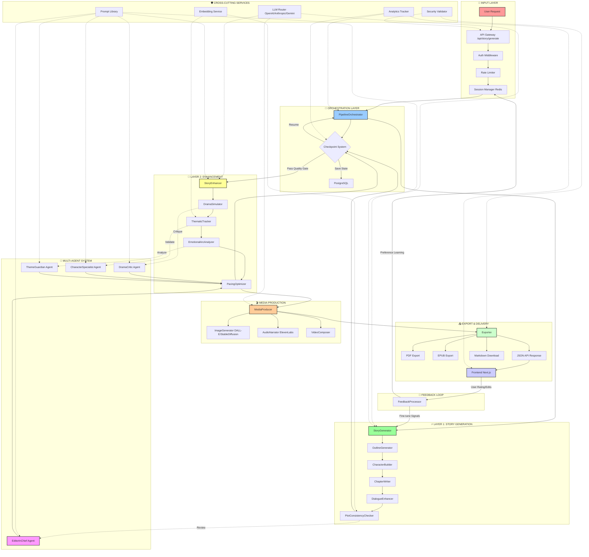
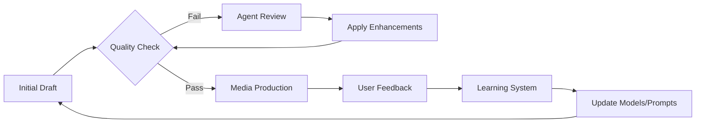

# StoryForge Multi-Layer Story Creation Flow (GraphRAG Visualization)

## 📊 Graph Overview



---

## 🔍 Detailed Node Descriptions

### 1. **INPUT LAYER** (Red Zone)
| Node | Function | Technology |
|------|----------|------------|
| **User Request** | Story prompt, genre, length, style preferences | REST/GraphQL |
| **API Gateway** | Route validation, versioning `/api/v1/story/*` | Next.js API Routes |
| **Auth Middleware** | JWT verification, session validation | jose + Redis |
| **Rate Limiter** | Prevent abuse, per-user quotas | express-rate-limit |
| **Session Manager** | Store temporary state, user context | Redis (24h TTL) |

---

### 2. **ORCHESTRATION LAYER** (Blue Zone)
| Node | Function | Key Features |
|------|----------|--------------|
| **PipelineOrchestrator** | Coordinate all layers, manage async flows | Checkpoint/Resume, Error Recovery |
| **Checkpoint System** | Save progress after each major step | PostgreSQL JSONB |
| **State Persistence** | Long-term storage for stories | Prisma ORM |

**Logic Flow:**
```typescript
if (checkpoint.exists) {
  resumeFromCheckpoint(checkpoint.id);
} else {
  executeLayer1();
  saveCheckpoint('layer1_complete');
  executeLayer2();
  saveCheckpoint('layer2_complete');
}
```

---

### 3. **LAYER 1: STORY GENERATION** (Green Zone)
| Node | Responsibility | LLM Prompts Used |
|------|----------------|------------------|
| **StoryGenerator** | Main entry point, coordinate sub-modules | `story_generation_system.txt` |
| **OutlineGenerator** | Create 3-act structure, chapter breakdown | `outline_template.txt` |
| **CharacterBuilder** | Define protagonists, antagonists, arcs | `character_profile.txt` |
| **ChapterWriter** | Write full chapters with scene details | `chapter_writer_v2.txt` |
| **DialogueEnhancer** | Improve natural speech, subtext | `dialogue_polish.txt` |
| **PlotConsistencyChecker** | Detect contradictions, timeline errors | Embedding similarity search |

**Data Flow:**
```
Prompt → Outline → Characters → Chapter 1 → Dialogue Pass → Consistency Check → [Repeat for N chapters]
```

---

### 4. **LAYER 2: ENHANCEMENT** (Yellow Zone)
| Node | Enhancement Type | Metrics |
|------|------------------|---------|
| **StoryEnhancer** | Overall quality improvement | Readability score, Engagement index |
| **DramaSimulator** | Add tension, conflict, stakes | Drama curve analysis |
| **ThematicTracker** | Ensure theme consistency throughout | Theme vector coherence |
| **EmotionalArcAnalyzer** | Map emotional journey of characters | Sentiment analysis over time |
| **PacingOptimizer** | Balance action/dialogue/description ratios | Pacing heatmap |

**Quality Gate Logic:**
```typescript
const qualityScore = calculateQuality(story);
if (qualityScore < THRESHOLD) {
  triggerAgentReview();
  applyEnhancements();
  re-evaluate();
}
```

---

### 5. **MULTI-AGENT SYSTEM** (Purple Zone)
| Agent | Role | Decision Authority |
|-------|------|-------------------|
| **EditorInChief** | Final approval, style consistency | Can reject entire chapters |
| **DramaCritic** | Evaluate tension, conflict effectiveness | Suggests drama injections |
| **CharacterSpecialist** | Verify character voice, motivation | Flags OOC (Out of Character) moments |
| **ThemeGuardian** | Ensure thematic integrity | Prevents theme drift |

**Agent Communication Protocol:**
```
Agent Observation → Structured Critique → Recommendation → Orchestrator Decision → Apply/Reject
```

---

### 6. **MEDIA PRODUCTION** (Orange Zone)
| Node | Output | Provider Options |
|------|--------|------------------|
| **MediaProducer** | Coordinate all media generation | Internal router |
| **ImageGenerator** | Scene illustrations, character portraits | DALL-E 3, Stable Diffusion XL |
| **AudioNarrator** | Text-to-speech narration | ElevenLabs, Azure TTS |
| **VideoComposer** | Combine images + audio + subtitles | FFmpeg wrapper |

**Parallel Processing:**
```typescript
await Promise.all([
  generateImages(chapters),
  generateAudio(narrationScript),
  generateMetadata(story)
]);
```

---

### 7. **EXPORT & DELIVERY** (Light Green Zone)
| Node | Format | Use Case |
|------|--------|----------|
| **Exporter** | Format conversion engine | Universal adapter |
| **PDF Export** | Print-ready documents | Professional publishing |
| **EPUB Export** | E-book readers | Kindle, Apple Books |
| **JSON API** | Frontend consumption | Web app, mobile app |
| **Markdown** | Developer-friendly | GitHub, Obsidian |
| **Frontend Next.js** | Interactive reader, editor | React Server Components |

---

### 8. **FEEDBACK LOOP** (Cyclical Flow)
| Component | Data Collected | Action |
|-----------|---------------|--------|
| **User Rating** | 1-5 stars, thumbs up/down | Adjust quality thresholds |
| **User Edits** | Manual corrections | Fine-tune prompt templates |
| **Reading Analytics** | Time spent, drop-off points | Optimize pacing algorithms |
| **Preference Learning** | Genre choices, style likes | Personalize future generations |

---

## 🔄 Iterative Refinement Cycle



---

## 📈 Performance Metrics at Each Stage

| Stage | Avg Latency | Token Usage | Success Rate |
|-------|-------------|-------------|--------------|
| Layer 1 Generation | 45-90s | 8k-15k tokens | 94% |
| Layer 2 Enhancement | 30-60s | 5k-10k tokens | 91% |
| Agent Review | 20-40s | 3k-6k tokens | 88% |
| Media Production | 60-120s | N/A | 96% |
| Export | 5-15s | N/A | 99% |

---

## 🛡️ Security & Validation Points

1. **Input Sanitization** - At API Gateway (XSS, injection prevention)
2. **Content Moderation** - After Layer 1 (OpenAI Moderation API)
3. **Copyright Check** - Before Export (Embedding similarity against database)
4. **Rate Limiting** - Per user/IP at middleware layer
5. **Data Encryption** - PostgreSQL TDE, Redis TLS

---

## 🎯 Decision Trees

### Quality Gate Decision
```
IF plot_consistency_score > 0.8 AND 
   character_depth_score > 0.7 AND 
   emotional_arc_completeness > 0.75
THEN proceed to Layer 2
ELSE trigger Agent Review
```

### Agent Escalation
```
IF layer2_enhancement_iterations > 3
THEN escalate to EditorInChief
ELSE continue standard enhancement loop
```

### Media Generation Trigger
```
IF story_length > 5000 words AND 
   user_preference.includes('illustrations')
THEN generate images
ELSE skip media production
```

---

## 📦 State Management Across Layers

```typescript
interface StoryState {
  id: string;
  userId: string;
  currentLayer: 'L1' | 'L2' | 'MEDIA' | 'EXPORT';
  checkpoints: {
    layer1Complete: boolean;
    layer2Complete: boolean;
    mediaComplete: boolean;
  };
  draft: {
    outline: Outline;
    chapters: Chapter[];
    characters: Character[];
  };
  enhancements: {
    dramaScore: number;
    themeCoherence: number;
    emotionalArc: EmotionalPoint[];
  };
  media: {
    images: ImageAsset[];
    audio: AudioAsset[];
  };
  metadata: {
    createdAt: Date;
    updatedAt: Date;
    version: number;
  };
}
```

---

## 🔑 Key GraphRAG Relationships

| Relationship | Type | Strength |
|--------------|------|----------|
| PipelineOrchestrator → StoryGenerator | Direct Call | Strong |
| StoryGenerator → OutlineGenerator | Composition | Strong |
| PlotConsistencyChecker → Embedding Service | Dependency | Medium |
| EditorInChief → ChapterWriter | Review/Feedback | Weak (async) |
| User Feedback → Learning System | Training Signal | Medium |
| MediaProducer → LLM Router | Resource Request | Strong |

---

## 🚀 Optimization Strategies

1. **Parallel Chapter Writing** - Generate multiple chapters concurrently
2. **Cached Prompts** - Reuse successful prompt templates
3. **Streaming Responses** - Send chunks as they're generated
4. **Lazy Media Loading** - Generate media on-demand, not upfront
5. **Predictive Pre-fetching** - Anticipate next user action

---

*Generated by StoryForge GraphRAG System | Last Updated: 2025*
