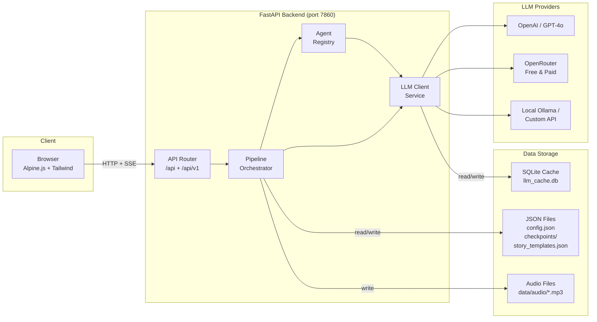
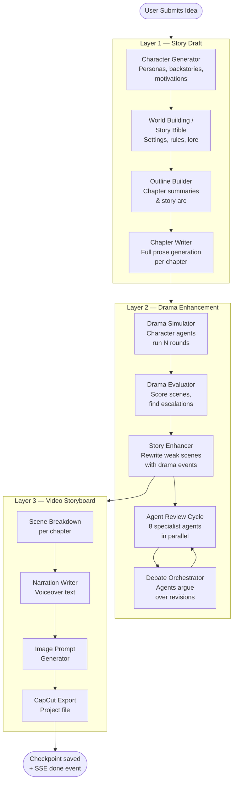
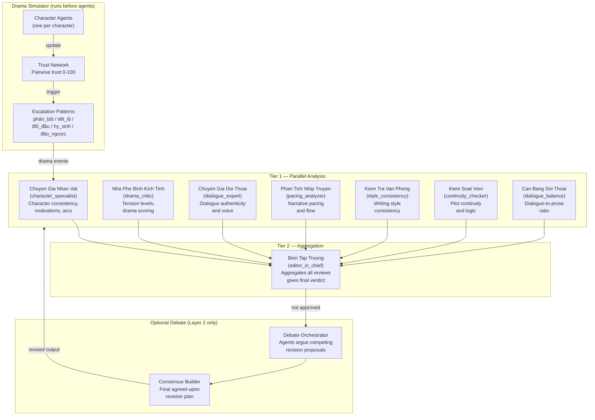
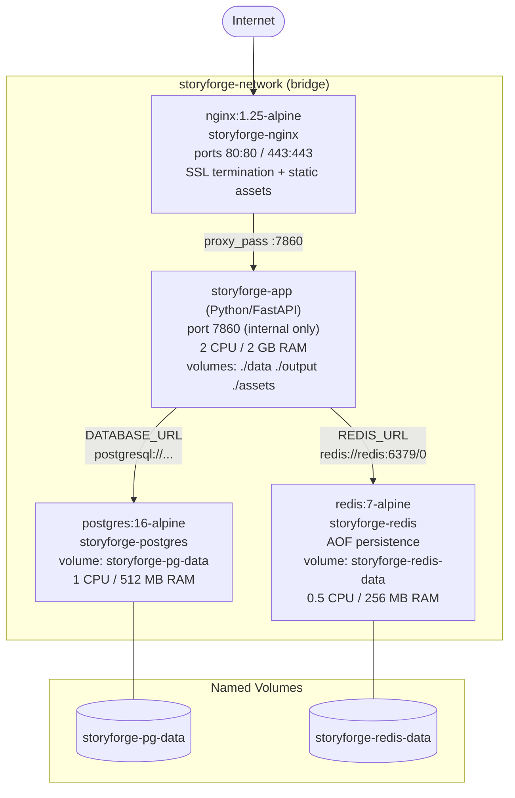

# StoryForge Architecture

## 1. System Overview



---

## 2. Three-Layer Pipeline

Story generation proceeds through three sequential layers. Each layer can be skipped or configured independently. Progress is streamed to the client via SSE.



---

## 3. Multi-Agent System

Layer 2 uses a registry of specialist AI agents that review story output in parallel tiers, then optionally debate their findings.



**Agent execution model:**

- All Tier 1 agents run in parallel via `ThreadPoolExecutor`
- `editor_in_chief` always runs last (Tier 2) and aggregates prior reviews
- If `enable_agent_debate` is on, the `DebateOrchestrator` runs between review cycles on Layer 2
- Up to `max_iterations` (default 3) review cycles per layer; stops early when all agents approve
- DAG-ordered tiered execution is used when agents declare dependencies; falls back to flat-parallel on cycle detection

---

## 4. Deployment Architecture

Production deployment uses Docker Compose with four services on an isolated bridge network.



**Health checks:**

| Service | Check | Interval |
|---------|-------|----------|
| postgres | `pg_isready -U storyforge` | 10 s |
| redis | `redis-cli ping` | 10 s |
| app | `GET /api/health` (HTTP 200) | 30 s |
| nginx | `wget --spider /api/health` | 30 s |

Startup order enforced by `depends_on` with `condition: service_healthy`.

---

## 5. Directory Structure

```
storyforge/
├── api/                    # FastAPI route modules
│   ├── __init__.py         # Router registry (mounts all sub-routers)
│   ├── auth_routes.py
│   ├── config_routes.py
│   ├── pipeline_routes.py  # SSE streaming, checkpoints
│   ├── export_routes.py    # PDF, EPUB, ZIP
│   ├── audio_routes.py     # TTS via edge-tts
│   ├── analytics_routes.py
│   ├── branch_routes.py    # Choose-your-own-adventure
│   ├── dashboard_routes.py
│   ├── feedback_routes.py
│   ├── ab_routes.py
│   ├── metrics_routes.py
│   └── v1/router.py        # Versioned mirror with X-API-Version header
│
├── pipeline/               # Core generation engine
│   ├── orchestrator.py     # Main entry point: run_full_pipeline()
│   ├── layer1_story/       # Draft generation
│   │   ├── character_generator.py
│   │   ├── story_bible_manager.py
│   │   ├── outline_builder.py
│   │   └── chapter_writer.py
│   ├── layer2_enhance/     # Drama enhancement
│   │   ├── simulator.py    # DramaSimulator + CharacterAgents
│   │   ├── analyzer.py
│   │   └── enhancer.py
│   ├── layer3_video/       # Storyboard generation
│   │   └── storyboard.py
│   └── agents/             # Specialist review agents
│       ├── base_agent.py
│       ├── agent_registry.py
│       ├── agent_graph.py  # DAG dependency resolver
│       ├── debate_orchestrator.py
│       ├── character_specialist.py
│       ├── drama_critic.py
│       ├── dialogue_expert.py
│       ├── pacing_analyzer.py
│       ├── style_consistency.py
│       ├── continuity_checker.py
│       ├── dialogue_balance.py
│       └── editor_in_chief.py
│
├── services/               # Shared services
│   ├── llm_client.py       # OpenAI-compatible HTTP client
│   ├── llm_cache.py        # SQLite response cache
│   ├── auth.py             # JWT creation
│   ├── user_store.py       # User persistence
│   ├── metrics.py          # Prometheus counters
│   ├── i18n.py             # Internationalisation
│   └── onboarding_analytics.py
│
├── models/schemas.py       # Pydantic data models
├── middleware/             # Auth middleware, rate limiting, CORS
├── config.py               # ConfigManager, PIPELINE_PRESETS, MODEL_PRESETS
├── app.py                  # FastAPI app factory, lifespan
├── web/                    # Static HTML/JS frontend (Alpine.js)
├── data/                   # Templates, audio, test timings
├── output/checkpoints/     # Saved pipeline state (JSON)
├── docs/                   # Project documentation
├── nginx/                  # nginx.conf, ssl-params.conf
├── Dockerfile
└── docker-compose.production.yml
```
