# System Architecture

## Overview

StoryForge is a 2-layer AI story generation pipeline (plus optional L3 sensory polish) with a FastAPI backend, Alpine.js frontend, and production-ready monitoring stack.

**Entry point:** `PipelineOrchestrator.run_full_pipeline()` → `pipeline/orchestrator_layers.py::run_full_pipeline()` (async; blocking LLM calls offloaded via `asyncio.to_thread`).

### Full pipeline flow (as implemented)

```
┌─ PRE-FLIGHT ────────────────────────────────────────────────┐
│  LLMClient.check_connection  |  PipelineTrace  |  Tracker   │
│  AgentRegistry boot (opt, enable_agents=True)               │
└─────────────────────────────────────────────────────────────┘
                               │
┌─ LAYER 1 — STORY GENERATION (pipeline/layer1_story) ────────┐
│  theme_premise_generator                                    │
│  → character_generator + voice_profiler                     │
│  → outline_builder + outline_critic                         │
│  → conflict_web_builder + foreshadowing_manager             │
│  → scene_decomposer + scene_beat_generator                  │
│  → chapter_writer (asyncio.gather, chapter_batch_size=5,    │
│    optional per-batch checkpoint callback)                  │
│  → post_processing                                          │
│  ── save checkpoint(1)                                      │
│  ── context.compute_health_score() + extraction_failures    │
│  ── QualityScorer.score_story(layer=1) (opt)                │
│  ── QualityGate.check() → 1 retry of full L1 (opt)          │
│  ── StoryAnalytics (words, reading time, dialogue ratio)    │
│  ── StoryKnowledgeGraph.build_from_story_draft / unified    │
│  ── AgentRegistry.run_review_cycle(layer=1) (opt)           │
└─────────────────────────────────────────────────────────────┘
                               │
┌─ STRUCTURAL REWRITE BRIDGE (L2 diagnoses → L1 rewrites) ────┐
│  Flag: enable_structural_rewrite (default True)             │
│  enhancer.detect_structural_issues(draft, arc_waypoints,    │
│    threshold=structural_rewrite_threshold)                  │
│  → per weak chapter: story_gen.write_chapter() with         │
│    fix_hints packed into enhancement_context                │
│  → replace chapter in draft, mark _rewritten_chapters       │
│  Cap: max_structural_rewrites × len(chapters)               │
└─────────────────────────────────────────────────────────────┘
                               │
┌─ LAYER 2 — DRAMA ENHANCEMENT (pipeline/layer2_enhance) ─────┐
│  ThematicTracker.extract_theme(draft)                       │
│  plugin_manager.apply_genre_rules(genre, base_rules)        │
│                                                             │
│  L1 → L2 signals (flag: l2_use_l1_signals):                 │
│    • arc_waypoints (flattened from draft.characters)        │
│    • threads (open + resolved)                              │
│    • pacing_adjustment (from draft.context)                 │
│    • conflict_web                                           │
│    • foreshadowing_plan                                     │
│    • voice_fingerprints (via draft.voice_profiles)          │
│                                                             │
│  calculate_adaptive_rounds(characters, threads,             │
│    conflict_web) → 4–10 rounds (flag: adaptive_sim_rounds)  │
│                                                             │
│  analyzer.analyze(draft, conflict_web)                      │
│    → relationships + structural analysis                    │
│  simulator.run_simulation(...)                              │
│    → multi-agent debate                                     │
│    → knowledge_registry + causal_graph                      │
│    → exposed to draft via draft._knowledge_registry /       │
│      draft._causal_graph (Phase B causal audit)             │
│  enhancer.enhance_with_feedback(draft, sim_result,          │
│    theme_profile)                                           │
│    → scene-level rewrite + voice preservation               │
│    → ChapterContract validation (Phase E contract_gate)     │
│                                                             │
│  ── save checkpoint(2)                                      │
│  ── QualityScorer(layer=2) + QualityGate 1-retry (opt)      │
│  ── Analytics + contract_stats + voice_stats                │
│  ── AgentRegistry.run_review_cycle(layer=2) (opt)           │
│  ── SmartRevisionService.revise_weak_chapters (opt,         │
│    flag: enable_smart_revision)                             │
│                                                             │
│  L2 failure → fallback to original draft,                   │
│    output.status="partial", drama_score=0.0                 │
└─────────────────────────────────────────────────────────────┘
                               │
┌─ LAYER 3 — SENSORY POLISH (optional) ───────────────────────┐
│  Flag: enable_layer3. Prose refinement, imagery, flow       │
└─────────────────────────────────────────────────────────────┘
                               │
┌─ POST ──────────────────────────────────────────────────────┐
│  MediaProducer.run(draft, enhanced) — character portraits + │
│    scene backgrounds (opt, enable_media + image_provider)   │
│  trace.summary() attached to output.trace                   │
│  progress_events attached to output                         │
│  Output persisted to Redis under session key (24h TTL)      │
│  Export: PDF · EPUB · HTML · ZIP                            │
└─────────────────────────────────────────────────────────────┘
```



```mermaid
flowchart TB
    idea([User Idea]) --> pre[Pre-flight: LLM check · Trace · Agents]
    pre --> L1

    subgraph L1 [Layer 1 — Story Generation]
        direction TB
        theme[Theme + Premise] --> chars[Characters + Voice Profiles]
        chars --> outline[Outline + Critic]
        outline --> web[Conflict Web + Foreshadowing]
        web --> scenes[Scene Decomposer + Beats]
        scenes --> chapters[Chapter Writer · parallel batches]
        chapters --> post[Post-processing]
    end

    L1 --> gate1[Checkpoint · Health · Scorer · Gate · KG · Agent Review]
    gate1 --> bridge{Structural issues?}
    bridge -- yes --> rewrite[L1 rewrites weak chapters<br/>with L2 fix_hints] --> L2
    bridge -- no --> L2

    subgraph L2 [Layer 2 — Drama Enhancement]
        direction TB
        theme2[ThematicTracker] --> signals[L1 Signals: arcs · threads · conflict<br/>foreshadowing · pacing · voice]
        signals --> rounds[Adaptive Rounds 4–10]
        rounds --> analyzer[Analyzer]
        analyzer --> sim[Simulator · multi-agent debate<br/>+ causal_graph + knowledge_registry]
        sim --> enhancer[Enhancer · scene rewrite<br/>+ voice preservation + contract_gate]
    end

    L2 --> gate2[Checkpoint · Scorer · Gate · Agent Review · SmartRevision]
    gate2 --> L3[L3 Sensory Polish · optional]
    L3 --> media[Media · Trace · Redis persist]
    media --> export([PDF · EPUB · HTML · ZIP])
```

**Retry / rewrite loops in play:**
- **QualityGate** (per layer): 1 full-layer retry if score < threshold
- **Structural rewrite**: L2 detects → L1 rewrites weak chapters (capped)
- **SmartRevision**: per-chapter fix after L2 using agent reviews
- **Contract gate**: per-chapter single-retry rewrite inside enhancer

**Failure semantics:** L1 hard-fails abort the pipeline; L2 failures are non-fatal (fallback to draft, `status="partial"`).

## Phase E: Contract Gate Architecture

L2 now validates enhanced chapters against Phase 1 `ChapterContract` constraints (character count, pacing, dialogue ratio, arc progression):

```
Enhanced Chapter
    ↓
[Contract Validation]
    ├─ Compare actual vs contract targets
    ├─ Classify failures: critical (arc OOB, missing chars) vs warning (pacing off)
    └─ If ≥2 critical OR (≥1 critical + ≥2 warnings):
         ↓
    [LLM Rewrite]
        ├─ Call CONTRACT_REWRITE prompt with contract targets
        └─ Check regression: accept only if quality improves
             ↓
    [Revert or Accept]
        └─ Return fixed or original chapter

**Feature Flag**: `config.pipeline.l2_contract_gate` (default True)
```

Integrated into L2 pipeline post-coherence-fix, post-causal-audit. Non-fatal; logs issues but allows pipeline to continue.

## Phase C: Thread-Urgency → Psychology Pressure Architecture

L2 now applies pure Python pressure scoring to active plot threads based on urgency and narrative staleness:

```
Simulator Setup
    ↓
[Parallel Psychology Extraction]
    ├─ Character psychology profiles extracted
    └─ Plot thread urgency + staleness indexed
         ↓
[Apply Thread Pressure]
    ├─ PsychologyEngine.apply_thread_pressure(psychology, threads, current_chapter, max_bump=0.30)
    ├─ For involved_characters:
    │   ├─ urgency≥4 AND staleness≥2 → +0.15
    │   └─ urgency==5 AND open → +0.05 additional
    └─ Fallback: never-mentioned threads use planted_chapter
         ↓
[Drama Potential Computation]
    └─ higher pressure → higher drama_multiplier → intense posts
```

**Feature Flag**: `config.pipeline.l2_thread_pressure` (default True)

## Phase B: Causal Accountability Architecture

L2 simulator now tracks knowledge revelation as explicit causal events, validates causality in enhanced text via LLM audit.

```
Simulator Round
    ↓ (each round)
[Record Revelation Events]
    ├─ Secret X revealed by A → B
    ├─ Type: tiết_lộ, cause_event_id points to prior X reveal
    └─ Witness propagation: chars posting ±1 gain knowledge
         ↓
[Enhanced Chapter + KnowledgeRegistry + CausalGraph]
    ├─ draft._knowledge_registry (private attr)
    └─ draft._causal_graph (private attr)
         ↓
[Post-Coherence Audit]
    └─ audit_revelation_causality():
       ├─ LLM extracts "X knows Y" claims from enhanced text
       ├─ Cross-checks against reveal_log + KnowledgeRegistry
       ├─ Flags critical (impossible knowledge) & warning (wrong attribution)
       └─ Return audit_report with flagged events

**Feature Flag**: l2_causal_audit (default True)

**KnowledgeItem.reveal_log**: [RevealEntry(char, round, source, event_id)]
- source ∈ {initial, told, discovered, witness}
- Initial holder seeded with source="initial"
- Critical: claimed_source ∉ known_by → impossible knowledge
- Warning: claimed_source not in first 2 entries of reveal_log → wrong chain attribution
```

## Phase A: Layer 1 → Layer 2 Signal Integration

Layer 2 now reads and processes 4 L1 output signals for enhanced narrative control:

```
L1: Chapter + Draft + StoryBible
    ├─ arc_waypoints (L1 → L2 via Chapter.contract)
    ├─ structured_summary (L1 → L2 for scene gates)
    ├─ pacing_directive (L1 → L2 for drama intensity)
    └─ PlotThread.status (L1 → L2 for event validation)
         ↓
L2: Signal-Aware Agent Simulation
    ├─ CharacterAgent respects arc_waypoints
    ├─ SceneEnhancer preserves L1 facts via thread_status
    ├─ AdaptiveController modulates drama by pacing_directive
    └─ Simulator validates events via thread gates
         ↓
    Enhanced Story (L1 facts + L2 drama)
```

**Feature Flag**: `l2_use_l1_signals` (config/defaults.py, default: enabled)

## Layer 1 Pipeline: Story Generation

Layer 1 generates story structure in stages:

```
1. Setup (characters, world, outline)
   ↓
2. Batch Generation (parallel chapter writing)
   ├─ Outline critique + revision loop
   ├─ Scene decomposition
   ├─ Character voice profiling
   ├─ Theme premise anchoring
   └─ Arc progression cache (waypoint tracking)
   ↓
3. Chapter Writing (per-chapter)
   ├─ NarrativeContextBlock assembly (unified context)
   ├─ Pacing enforcer validation
   ├─ Call LLM with adaptive prompt
   ├─ Self-critique with rollback (quality gate)
   ├─ Extract: summary, character states, plot events
   ├─ Consistency validation (zero-cost heuristics)
   ├─ Story bible update (timeline, locations, threads)
   └─ Show-don't-tell enforcement
   ↓
4. Continuation (resume from checkpoint)
   ├─ Fetch last written chapter
   ├─ Rebuild context window
   └─ Resume at next chapter
```

**Key Components** (`pipeline/layer1_story/`):
- `generator.py` — Main orchestrator, calls batch_generator or story_continuation
- `batch_generator.py` — Parallel chapter generation with quality gates
- `chapter_writer.py` — Chapter text generation with context formatting
- `narrative_context_block.py` — Unified context assembly for LLM prompts
- `pacing_enforcer.py` — Pacing validation and enforcement
- `chapter_self_critique.py` — Self-critique with rollback on quality regression
- `arc_waypoint_generator.py` — Arc progression cache and waypoint tracking
- `consistency_validators.py` — Non-fatal post-write validation (timeline, names, arc drift)
- `story_bible_manager.py` — Long-term memory for 100+ chapter stories
- `post_processing.py` — Summary, state, event extraction + context updates
- `story_continuation.py` — Resume generation from checkpoint

**Quality Enhancements** (Phase 1):
- Theme premise anchoring (semantic consistency)
- Character voice profiling (dialogue distinctiveness)
- Outline critique & revision loop (structural coherence)
- Scene decomposition (pacing control)
- Show-don't-tell enforcement (narrative quality)
- Chapter self-critique (consistency review)

**Quality Enhancements** (Phase 2):
- NarrativeContextBlock for unified context assembly
- Pacing enforcer module for rhythm validation
- Self-critique with rollback on quality regression
- Arc progression cache for waypoint tracking

## Core Services Architecture

### Backend Stack

**Python 3.10+ / FastAPI / Uvicorn**

```
api/                    → REST endpoints (thin layer)
  ├── pipeline_routes.py    → SSE streaming, resumable checkpoints
  ├── health_routes.py      → Health checks with scale_ready flag
  ├── config_routes.py      → Settings CRUD
  └── export_routes.py      → PDF/EPUB/ZIP generation

services/               → Business logic
  ├── llm/                  → LLM client with fallback chain
  ├── quality_scorer.py     → 4-dimension evaluation (coherence, character, drama, style)
  ├── branch_narrative.py   → Choose-your-own-adventure reader
  ├── browser_auth/         → DEPRECATED in v3.x, removed in v4.0
  └── deepseek_web_client.py → DEPRECATED in v3.x, removed in v4.0

pipeline/               → 3-layer generation engine
  ├── orchestrator.py       → Checkpoint & resume logic
  ├── layer1_story/         → Story generation agents
  ├── layer2_enhance/       → Drama simulation (13 agents)
  ├── layer3_polish/        → Optional sensory polish (L3)
  └── agents/               → Stateless AI agent implementations
                            ├─ Character agents (voice-aware)
                            ├─ Conflict agents (escalation)
                            └─ Reader Simulator (engagement prediction)

middleware/             → Cross-cutting concerns
  ├── auth.py               → JWT token validation
  ├── rate_limiting.py      → Per-IP rate limiting (Redis-backed)
  └── audit_logging.py      → Request/response audit trail

models/schemas.py       → Pydantic data models

config.py               → Singleton config manager
```

### Frontend Stack

**Alpine.js 3 + TypeScript + Tailwind CSS**

```
web/
  ├── index.html            → SPA root
  ├── js/                   → TypeScript source (compiled to JS)
  │   ├── app.ts            → Main Alpine app instance
  │   ├── components/       → Reusable Alpine components
  │   └── pages/            → Page-specific logic (create, reader, branching)
  └── css/main.css          → Tailwind utilities + custom styles
```

**Dark/Light Mode**: Full theme synchronization via CSS variables and localStorage.

### Data Persistence

| Storage | Purpose | Multi-Instance |
|---------|---------|-----------------|
| PostgreSQL | Persistent story data, user config, audit logs | Shared (required) |
| SQLite | LLM response cache (local), embeddings | Per-instance (optional) |
| Redis | Rate limiting, token revocation, session state | Shared (required for scale) |
| JSON files | Agent prompts, presets, exports | Mounted volume |

## Phase 1 Consistency Architecture

### Consistency Validation Pipeline

Post-write validation runs in `pipeline/layer1_story/post_processing.py`:

```
Chapter Written
    ↓
[Non-fatal Validators - Parallel / Sequential]
    ├─ Timeline & Location Extraction (1 cheap LLM call)
    ├─ Character Name Validation (Regex, zero cost)
    └─ Arc Drift Detection (Heuristic, zero cost)
    ↓
Story Context Updated
    ├─ timeline_positions dict
    ├─ character_locations dict
    ├─ arc_drift_warnings list
    └─ name_warnings list
    ↓
Story Bible Updated (if enabled)
    ├─ timeline_positions capped at 30
    ├─ character_locations capped at 30
    ├─ milestone_events tracked
    └─ active_threads managed (20-entry cap)
    ↓
Chapter Write Prompt Enhanced
    └─ _append_consistency_context() injects:
       ├─ Timeline markers (mốc thời gian)
       ├─ Character locations (vị trí)
       ├─ Arc drift warnings ([CẢNH BÁO])
       └─ Name issues ([TÊN NHÂN VẬT])
```

**Key Design Principles**:
1. **Non-fatal**: Validation failures don't crash pipeline; logged as warnings
2. **Cheap**: Name validation (regex) and arc drift (heuristic) have zero LLM cost
3. **Contextual**: Warnings fed back into next chapter's LLM prompt
4. **Capped**: Timeline/location storage bounded at 30 entries (prevent memory bloat)

**Vietnamese Localization**:
- Arc stages: setup (giới thiệu), rising (phát triển), testing (thử thách), crisis (khủng hoảng), climax (cao trào), resolution (giải quyết)
- Warnings and prompts fully in Vietnamese

### Always-On Story Bible

Story Bible is now mandatory (no opt-out):
- Initialized with `StoryBibleManager.initialize()`
- Updated after each chapter with new events, threads, and timeline data
- Provides long-term memory context for chapters 100+
- Replaces rolling window approach for large stories

## Phase A: Layer 2 Signal Integration Architecture

### 1. Simulator Signal Ingestion (`pipeline/layer2_enhance/simulator.py`)

**setup_agents()**:
- Now accepts `arc_waypoints: list[dict]` (from Chapter.contract)
- Calls `_apply_arc_waypoints(waypoints, current_chapter)` to set CharacterAgent floor/stage
- CharacterAgent stores waypoint state: `waypoint_floor`, `waypoint_stage`

**run_simulation()**:
- Accepts `pacing_directive: str` (extracted via `_extract_pacing_directive()` in enhancer.py)
- Passes pacing to AdaptiveController for drama intensity modulation
- Validates event resolution against PlotThread.status via `_is_event_thread_valid()`

### 2. Signal Extraction (`pipeline/layer2_enhance/enhancer.py`)

**_extract_pacing_directive()**:
- Parses L1 draft for pacing cues (slow_down, escalate, neutral)
- Default: empty string (no pacing override)
- Gated by `l2_use_l1_signals` flag

**Signal Propagation**:
- Reads `Chapter.arc_waypoints` from L1 output
- Reads `Draft.structured_summary` for scene extraction guards
- Passes `pacing_directive` to SceneEnhancer + AdaptiveController
- All signals flow to `run_simulation()` in simulator

### 3. Scene Enhancement with L1 Context (`pipeline/layer2_enhance/scene_enhancer.py`)

**SCORE_SCENE_DRAMA + ENHANCE_SCENE Prompts**:
- New fields: `preserve_facts`, `thread_status`, `arc_context`
- Prevent drama rewrites from contradicting L1 plot threads
- Enforce character arc gates (waypoint_floor < current_arc < waypoint_stage)
- MIN_DRAMA threshold adjusts by pacing_directive: slow_down lowers threshold, escalate raises it

### 4. Adaptive Intensity Mapping (`pipeline/layer2_enhance/adaptive_intensity.py`)

**AdaptiveController** accepts `pacing_directive`:
- "slow_down" → DRAMA_TARGET = 0.55 (subdued conflict)
- "escalate" → DRAMA_TARGET = 0.75 (heightened drama)
- "" (default) → DRAMA_TARGET = 0.65 (standard)

### 5. L2 Quality Enhancements

**Parallel Feedback Rewrite**:
- Multiple agent feedback streams processed concurrently
- Reduces latency by parallelizing enhancement suggestions
- Aggregates feedback before final rewrite pass

**Knowledge Constraints**:
- Agents operate within character knowledge boundaries
- Prevents omniscient narrator leakage into character dialogue
- Cross-references KnowledgeRegistry during enhancement

**Coherence Pre-check**:
- Validates chapter coherence before enhancement begins
- Early exit if chapter already meets quality thresholds
- Reduces unnecessary LLM calls for high-quality L1 output

**Agent Reasoning (CoT)**:
- Chain-of-thought prompting for agent decisions
- Explicit reasoning traces for conflict escalation choices
- Improves drama quality through structured deliberation

## Layer 3: Sensory Polish (Optional)

L3 is an optional post-L2 layer for prose refinement:

```
L2 Enhanced Chapter
    ↓
┌─────────────────────────────────────┐
│   L3: Sensory Polish                │
│   (Optional, gated by feature flag) │
└────────────┬────────────────────────┘
    ↓
[Prose Refinement]
    ├─ Sensory detail injection (sight, sound, smell, touch, taste)
    ├─ Rhythm and flow optimization
    ├─ Imagery enhancement
    └─ Sentence variety analysis
    ↓
[Quality Validation]
    ├─ Word count preservation check
    ├─ Voice consistency validation
    └─ Semantic drift detection
    ↓
Polished Chapter
```

**Feature Flag**: `config.pipeline.enable_l3_sensory_polish` (default: False)

**Key Characteristics**:
- Non-destructive: preserves L2 drama and L1 plot structure
- Focused on prose quality, not content changes
- Minimal LLM cost (single refinement pass)
- Optional bypass for genre/style preferences

## P3 Sprint Architecture Changes

### 1. Redis Authentication & Security

**Change**: Production Redis now requires password authentication.

```yaml
# docker-compose.production.yml
redis:
  command: redis-server --appendonly yes --appendfsync everysec --requirepass ${REDIS_PASSWORD}
  healthcheck:
    test: ["CMD", "redis-cli", "-a", "${REDIS_PASSWORD}", "ping"]
```

**Impact**:
- `REDIS_URL` now includes password: `redis://:${REDIS_PASSWORD}@redis:6379/0`
- Health check script uses `-a "${REDIS_PASSWORD}"` flag
- Environment: `.env.production` requires `REDIS_PASSWORD` (min 32 chars)

### 2. Nginx Sticky Sessions for Horizontal Scaling

**Change**: `ip_hash` directive added to nginx upstream block for SSE stream affinity.

```nginx
upstream storyforge_app {
    ip_hash;  # Route same client IP to same app instance
    server app:7860;
    keepalive 32;
}
```

**Why**: Server-Sent Events (SSE) streams for pipeline progress must route to the same app instance.

**Impact**:
- Enables horizontal scaling: `docker compose --scale app=3`
- Client IP → consistent app instance routing
- Required for multi-instance deployments with SSE

### 3. Health Check API Enhancement

**Change**: Deep health check now includes `scale_ready` field.

```python
# api/health_routes.py
scale_ready = redis_ok and db_ok

return JSONResponse(
    content={
        "status": overall,
        "scale_ready": scale_ready,
        "components": checks,
    }
)
```

**Fields**:
- `scale_ready` (bool): `True` if Redis + PostgreSQL are both healthy
- `components`: Per-component status (database, redis, disk, memory, llm)
- `status`: overall ("ok" if no critical failures, "degraded" otherwise)

**Use case**: Orchestrators check `scale_ready` before scaling to N instances.

### 4. Cached SQLAlchemy Engine

**Change**: Database connection pooling now uses a cached engine instance.

```python
# api/health_routes.py
_health_engine = None

def _check_database():
    global _health_engine
    if _health_engine is None:
        _health_engine = create_engine(db_url, pool_pre_ping=True, ...)
    with _health_engine.connect() as conn:
        conn.execute(text("SELECT 1"))
```

**Benefits**:
- Faster health checks (reuses connection pool)
- Reduced connection overhead on repeated probes
- Single engine per health check process

### 5. Deprecation Warnings for Browser Auth

**Changes**:
- `services.browser_auth.BrowserAuth` → emits `DeprecationWarning` on init
- `services.deepseek_web_client.DeepSeekWebClient` → emits `DeprecationWarning` on init
- UI helper `_get_browser_auth()` → centralizes deprecation logging in settings tab

**Code**:
```python
# services/browser_auth/__init__.py
def __init__(self):
    warnings.warn(
        "BrowserAuth is deprecated and will be removed in v4.0. "
        "Use API key authentication instead.",
        DeprecationWarning,
        stacklevel=2,
    )
```

```python
# ui/tabs/settings_tab.py
_DEPRECATION_MSG = (
    "BrowserAuth (browser-based credential capture) is deprecated and will be "
    "removed in v4.0. Use API key authentication (STORYFORGE_API_KEY) instead."
)

def _get_browser_auth():
    """Import BrowserAuth with deprecation warning. Raises on failure."""
    _log.warning(_DEPRECATION_MSG)
    from services.browser_auth import BrowserAuth
    return BrowserAuth()
```

**DRY Refactor**: Settings tab now centralizes all browser auth calls through `_get_browser_auth()`, eliminating code duplication.

## Deployment Architecture

### Development

```bash
python app.py  # Single container, SQLite cache, no Redis required
```

### Production (Single Instance)

```bash
docker compose -f docker-compose.production.yml up -d
# Requires: PostgreSQL, Redis, Nginx, monitoring stack
```

### Production (Multi-Instance Scaling)

```bash
docker compose -f docker-compose.production.yml up -d --scale app=3
# Sticky sessions (nginx ip_hash) + Redis shared state + PostgreSQL replication
```

## High-Availability Considerations

For production HA deployments:

1. **Database**: PostgreSQL replication (host or managed service)
2. **Redis**: Sentinel or Cluster mode for high availability
3. **Load Balancer**: Keep nginx or deploy external LB with sticky sessions
4. **Monitoring**: Prometheus + Grafana for alerting

See [deployment-production.md](./deployment-production.md) for detailed setup.

## Performance & Caching

**LLM Cache**:
- SQLite (local, per-instance)
- TTL-based expiration
- Reduces API calls by caching similar prompts

**Connection Pooling**:
- PostgreSQL: `pool_pre_ping=True` for safe connection reuse
- Redis: Built-in connection pooling via redis-py
- HTTP: Nginx keepalive connections to app

**Rate Limiting**:
- Redis-backed (shared across instances)
- Per-IP throttling
- Token bucket algorithm

## Security Architecture

**JWT Authentication**:
- Tokens signed with `SECRET_KEY`
- Stored in browser cookies (HttpOnly, Secure flags)
- Validated on every API request

**CORS**:
- Whitelist configured via `ALLOWED_ORIGINS`
- Prevents cross-site request forgery

**TLS/SSL**:
- Nginx terminates HTTPS
- Let's Encrypt certificates (auto-renewed via certbot)
- HSTS enforced (max-age=63072000)

**Audit Logging**:
- All API requests logged with timestamp, user, endpoint, status
- Stored in PostgreSQL for forensics
